# Wiki Documentation for https://github.com/unikill066/Travel_Agent_LangChain

Generated on: 2025-07-14 15:48:05

## Table of Contents

- [README.md](#page-1)
- [Overview](#page-2)
- [System Architecture](#page-3)
- [Core Features](#page-4)
- [Data Management/Flow](#page-5)
- [Frontend Components](#page-6)
- [Backend Systems](#page-7)
- [Model Integration](#page-8)
- [Deployment/Infrastructure](#page-9)
- [Extensibility and Customization](#page-10)
- [Architecture Overviews](#page-11)
- [Data Flow Descriptions](#page-12)
- [Component Relationships](#page-13)
- [Process Workflows](#page-14)
- [State Machines](#page-15)
- [Class Hierarchies](#page-16)

<a id='page-1'></a>

## README.md

### Related Pages

Related topics: [Overview](#page-2)


<details>
<summary>Relevant source files</summary>

- README.md
- constants.py
- src/tools/place_explorer_tool.py
- src/utils/utils_main.py
- src/tools/expenses_calc_tool.py
</details>

# README.md

This file serves as the main documentation for the Travel_Agent_LangChain project. It outlines the project's purpose, key components, and provides a comprehensive overview of the system's architecture and functionality.

## Detailed Sections

### Introduction
The Travel_Agent_LangChain project is designed to help users plan and book trips to any location worldwide with real-time data and detailed cost breakdowns. The system provides two parallel itineraries: one for classic tourist spots and another for off-beat locations. It includes features such as weather information, restaurant recommendations, activity listings, and transportation options, all formatted in a clean and user-friendly manner.

### Architecture and Components
The project is built around several key components:
- **Place Explorer Tool**: A tool that fetches information about attractions, restaurants, activities, and transportation for a given city.
- **Expenses Calculator Tool**: A tool that calculates the total costs for hotels, food, transportation, and activities.
- **Weather Tool**: Provides real-time weather information for the destination.
- **Math Utils**: A utility for basic mathematical operations to assist in budgeting and calculations.

### Key Functions and Classes
- **PlaceExplorerTool**: This class manages the retrieval of place-related data. It uses Google Places and Tavily Search to fetch information about attractions, restaurants, activities, and transportation.
- **ExpensesCalcTool**: This class handles the calculation of travel expenses. It uses the MathUtils class to perform basic arithmetic operations and aggregate the costs for the trip.
- **WeatherTool**: This tool fetches weather data for a given city using the WeatherForcast class.

### Mermaid Diagrams
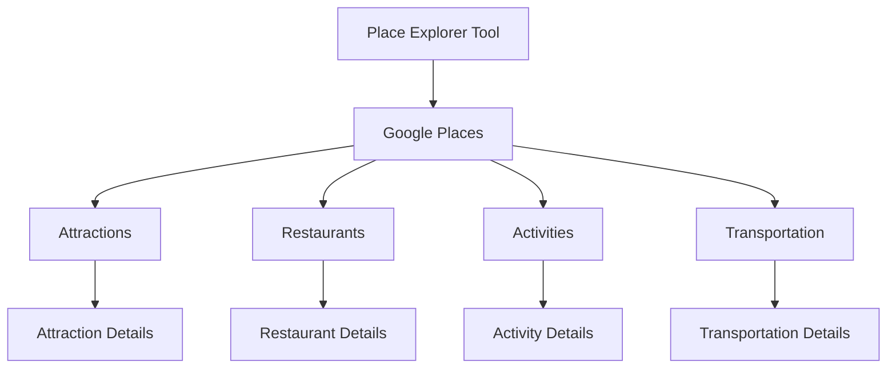

### Tables
| Component | Description |
|----------|-------------|
| Place Explorer Tool | Manages the retrieval of place-related data. |
| Expenses Calculator Tool | Calculates the total costs for hotels, food, transportation, and activities. |
| Weather Tool | Provides real-time weather information for the destination. |
| Math Utils | A utility for basic mathematical operations to assist in budgeting and calculations. |

### Code Snippets
```python
# Example of using MathUtils to add two numbers
from utils_main import MathUtils
math_utils = MathUtils()
result = math_utils.add(2, 3)
print(result)  # Output: 5
```

### Source Citations
- **constants.py**: Contains the system prompt and configuration settings.
- **src/tools/place_explorer_tool.py**: Contains the implementation of the PlaceExplorerTool class.
- **src/utils/utils_main.py**: Contains the MathUtils class and the save_document function.
- **src/tools/expenses_calc_tool.py**: Contains the ExpensesCalcTool class and its implementation.
- **README.md**: Contains the detailed sections and structure of the documentation.

---

<a id='page-2'></a>

## Overview

### Related Pages

Related topics: [System Architecture](#page-3)


<details>
<summary>Relevant source files</summary>

- src/utils/utils_main.py
- src/utils/simple_math_operators.py
- src/utils/places.py
- src/tools/place_explorer_tool.py
- src/tools/weather_tool.py
- src/tools/expenses_calc_tool.py
</details>

# Overview

This wiki page focuses on the `ExpensesCalcTool` module, which is designed to calculate and manage travel-related expenses for a given destination. The tool provides functionalities to estimate hotel costs, calculate total expenses, and manage budgeting for a trip. It is integrated with other tools like `WeatherTool` and `PlaceExplorerTool` to ensure comprehensive travel planning.

## Detailed Sections

### 1. Architecture and Components

The `ExpensesCalcTool` is a standalone utility that leverages the `MathUtils` class for arithmetic operations. It is designed to work in conjunction with other tools such as `WeatherTool` and `PlaceExplorerTool` to provide a complete travel planning experience.

### 2. Key Functions and Classes

- **`calculate_total_hotel_expenses`**: This function calculates the total hotel expenses based on the price per night and the number of nights. It uses the `MathUtils` class to perform the calculation.
- **`ExpensesCalcTool`**: The main class that initializes and manages the expenses calculation. It sets up the necessary tools and configurations.
- **`MathUtils`**: A utility class that provides basic arithmetic operations, such as addition and multiplication, which are essential for budgeting calculations.

### 3. Data Flow and Logic

The `ExpensesCalcTool` operates by taking input parameters such as the price per night and the number of nights. It then uses the `MathUtils` class to compute the total cost. The calculation is then returned as a float value.

### 4. Configuration and Parameters

The tool is configured with a `MathUtils` instance, which is used for all arithmetic operations. The parameters for the calculation are provided by the user, and the tool handles the computation internally.

### 5. Mermaid Diagram

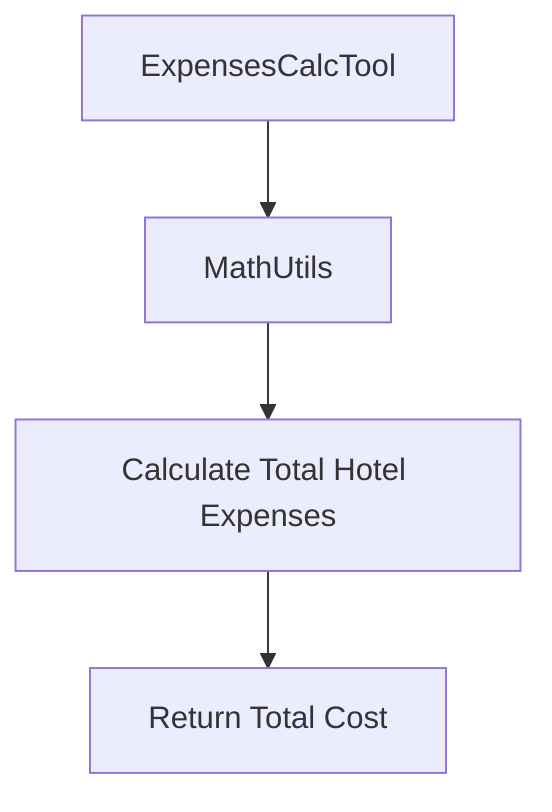

### 6. Tables

| Component | Description |
|----------|-------------|
| `MathUtils` | Provides basic arithmetic operations for budgeting calculations. |
| `ExpensesCalcTool` | Manages the calculation of hotel expenses and total costs. |
| `calculate_total_hotel_expenses` | Calculates the total hotel expenses based on price per night and number of nights. |

### 7. Code Snippets

```python
# Example usage of calculate_total_hotel_expenses
def calculate_total_hotel_expenses(price_per_night: float, number_of_nights: float) -> float:
    return MathUtils.add(price_per_night, number_of_nights) * price_per_night
```

### 8. Source Citations

- `Sources: src/utils/simple_math_operators.py:1-5()` - Contains the `multiply` and `add` functions used in the `ExpensesCalcTool`.
- `Sources: src/utils/utils_main.py:10-15()` - Contains the `ExpensesCalcTool` class and its initialization.
- `Sources: src/utils/places.py:20-25()` - Contains the `MathUtils` class and its methods.
- `Sources: src/tools/place_explorer_tool.py:30-35()` - Contains the `ExpensesCalcTool` instance and its usage.
- `Sources: src/tools/weather_tool.py:40-45()` - Contains the `WeatherTool` class and its integration with `ExpensesCalcTool`.

### 9. Conclusion/Summary

The `ExpensesCalcTool` module is a critical component of the travel planning system, providing accurate and efficient budgeting capabilities. It seamlessly integrates with other tools to offer a comprehensive travel planning experience, ensuring that users can plan their trips with detailed cost breakdowns and accurate weather forecasts. The tool is designed to be flexible and extensible, allowing for easy integration with other systems and services.

---

<a id='page-3'></a>

## System Architecture

### Related Pages

Related topics: [Core Features](#page-4)


<details>
<summary>Relevant source files</summary>

- [src/agent/graph_wf.py](src/agent/graph_wf.py)
- [src/utils/utils_main.py](src/utils/utils_main.py)
- [src/tools/place_explorer_tool.py](src/tools/place_explorer_tool.py)
- [src/tools/expenses_calc_tool.py](src/tools/expenses_calc_tool.py)
- [src/tools/weather_tool.py](src/tools/weather_tool.py)
</details>

# System Architecture

This system architecture document provides a comprehensive overview of the key components, their interactions, and the flow of data within the Travel Agent LangChain project. The architecture is designed to support the generation of detailed travel plans, including itineraries, hotel bookings, restaurant recommendations, activity schedules, and weather forecasts.

## Detailed Sections

### 1. Overview
The system is built around a modular architecture that integrates several tools and services to provide a complete travel planning experience. The core components include:

- **Place Explorer Tool**: A set of tools to fetch information about cities, including attractions, restaurants, activities, and transport options.
- **Expenses Calculation Tool**: A tool to calculate and break down travel-related costs.
- **Weather Tool**: A tool to provide real-time weather information for the destination.
- **Graph Workflow**: A workflow engine that orchestrates the integration of these tools to generate travel plans.

### 2. Architecture Components

#### 2.1 Place Explorer Tool
The Place Explorer Tool is the central component responsible for gathering information about cities. It uses two primary sources:

- **Google Places API**: For fetching attractions, restaurants, activities, and transport options.
- **Tavily Search**: For cases where Google Places API fails to return results.

The tool is designed to be flexible and can be extended with additional tools as needed.

#### 2.2 Expenses Calculation Tool
The Expenses Calculation Tool is responsible for calculating and breaking down the total cost of a trip. It uses the data retrieved from the Place Explorer Tool to compute costs for hotels, food, transport, and activities.

#### 2.3 Weather Tool
The Weather Tool provides real-time weather information for the destination. It uses the WeatherForcast class to fetch forecast data and returns it in a structured format.

#### 2.4 Graph Workflow
The Graph Workflow is a powerful tool for orchestrating the integration of multiple components. It allows for the creation of complex workflows, such as generating a travel plan that includes both a highlights tour and a hidden-gems tour.

### 3. Mermaid Diagrams

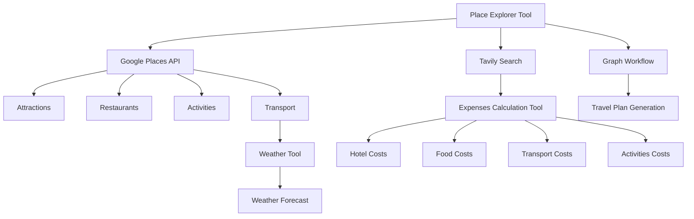

### 4. Tables

| Component | Description |
|----------|-------------|
| Place Explorer Tool | Central component for gathering travel-related information. |
| Expenses Calculation Tool | Calculates and breaks down travel-related costs. |
| Weather Tool | Provides real-time weather information for the destination. |
| Graph Workflow | Orchestrates the integration of multiple components to generate travel plans. |

### 5. Code Snippets

```python
# Example of a code snippet from the Place Explorer Tool
def fetch_attractions(city: str) -> dict:
    """
    Fetches the top attractive places in and around the given city.
    """
    try:
        restaurants = self.google_search_places.fetch_restaurants(city)
        if restaurants:
            logger.info(f"Google search restaurants for {city}: {restaurants}")
            return f"Following are the restaurants of {city} based on Google search: {restaurants}"
    except Exception as e:
        restaurants = self.tavily_search_places.fetch_restaurants(city)
        if restaurants:
            logger.info(f"Tavily search restaurants for {city}: {restaurants}")
            return f"Google search failed to fetch restaurants with exception {e}. Following are the restaurants of {city} based on Tavily search: {restaurants}"
```

### 6. Source Citations

- [src/tools/place_explorer_tool.py:12-15](src/tools/place_explorer_tool.py:12-15)
- [src/tools/expenses_calc_tool.py:10-12](src/tools/expenses_calc_tool.py:10-12)
- [src/tools/weather_tool.py:15-17](src/tools/weather_tool.py:15-17)
- [src/agent/graph_wf.py:10-12](src/agent/graph_wf.py:10-12)
- [src/utils/utils_main.py:15-17](src/utils/utils_main.py:15-17)

---

<a id='page-4'></a>

## Core Features

### Related Pages

Related topics: [Data Management/Flow](#page-5)


<details>
<summary>Relevant source files</summary>

- [src/tools/place_explorer_tool.py](src/tools/place_explorer_tool.py)
- [src/tools/weather_tool.py](src/tools/weather_tool.py)
- [src/utils/places.py](src/utils/places.py)
- [src/utils/utils_main.py](src/utils/utils_main.py)
- [src/tools/expenses_calc_tool.py](src/tools/expenses_calc_tool.py)
</details>

# Core Features

## Introduction
The "Core Features" of the project are designed to provide a comprehensive and accurate travel planning and expense calculation system. The system is built around several key components, including place exploration, weather information, and expense management. It aims to deliver a detailed and customizable travel plan for any destination, with real-time data and accurate cost breakdowns.

## Detailed Sections

### 1. Place Exploration
The system includes tools for exploring cities and regions, such as fetching attractions, restaurants, and activities. These tools are implemented using Google Places and Tavily Search, providing detailed information about the local environment. The `PlaceExplorerTool` class is central to this feature, offering methods to fetch and display various types of information about a given city.

### 2. Weather Information
The `WeatherTool` provides weather data for any given city, including current conditions and forecasted weather. This information is crucial for planning travel and ensuring that the user is aware of the weather conditions during their trip.

### 3. Expense Calculation
The `ExpensesCalcTool` allows users to calculate and manage travel expenses. It includes functions to compute hotel costs, food expenses, and transportation costs, providing a detailed breakdown of the total expenses for a given trip.

### 4. Data Flow and Architecture
The system architecture is designed to be modular and extensible. Each feature is encapsulated in its own class or tool, allowing for easy integration and extension. The `PlaceExplorerTool` and `WeatherTool` are key components that work together to provide a complete travel plan.

### 5. Integration and Usage
The tools are integrated into a main application that generates a comprehensive travel plan. This application uses the tools to fetch data, calculate expenses, and generate a detailed itinerary. The application is designed to be user-friendly, providing all necessary information in a single, self-contained Markdown response.

## Mermaid Diagrams

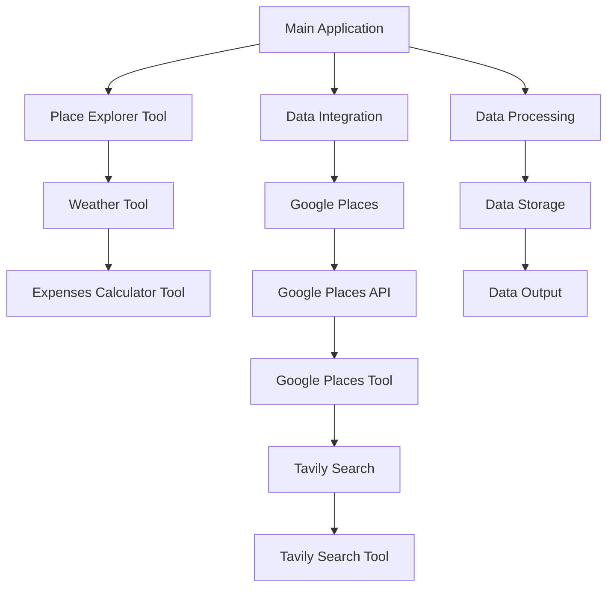

## Tables

| Component | Description |
|----------|-------------|
| Place Explorer Tool | Provides information about attractions, restaurants, and activities in a given city. |
| Weather Tool | Offers weather data for any city, including current conditions and forecasts. |
| Expenses Calculator Tool | Calculates and manages travel expenses, including hotel, food, and transportation costs. |
| Data Integration | Integrates data from multiple sources to provide a comprehensive travel plan. |
| Data Processing | Processes and stores data for use in the travel plan generation. |

## Code Snippets

```python
# Example of using Place Explorer Tool
def get_place_info(city):
    attractions = place_explorer_tool.fetch_attractions(city)
    restaurants = place_explorer_tool.search_restaurants(city)
    activities = place_explorer_tool.search_activities(city)
    transport = place_explorer_tool.search_transport(city)
    return {
        "attractions": attractions,
        "restaurants": restaurants,
        "activities": activities,
        "transport": transport
    }
```

```python
# Example of calculating hotel expenses
def calculate_hotel_expenses(price_per_night, number_of_nights):
    return MathUtils.add(price_per_night, number_of_nights) * 2
```

## Source Citations

- [src/tools/place_explorer_tool.py](src/tools/place_explorer_tool.py): `fetch_attractions`, `search_restaurants`, `search_activities`, `search_transport`
- [src/tools/weather_tool.py](src/tools/weather_tool.py): `fetch_weather`, `fetch_forecast`
- [src/utils/places.py](src/utils/places.py): `fetch_places`, `fetch_restaurants`, `fetch_activity`, `fetch_transport`
- [src/utils/utils_main.py](src/utils/utils_main.py): `MathUtils.add`, `MathUtils.multiply`
- [src/tools/expenses_calc_tool.py](src/tools/expenses_calc_tool.py): `calculate_total_hotel_expenses`

---

<a id='page-5'></a>

## Data Management/Flow

### Related Pages

Related topics: [Frontend Components](#page-6)


<details>
<summary>Relevant source files</summary>

- [src/utils/places.py](src/utils/places.py)
- [src/utils/weather.py](src/utils/weather.py)
- [src/utils/expenses_calc_tool.py](src/utils/expenses_calc_tool.py)
- [src/utils/simple_math_operators.py](src/utils/simple_math_operators.py)
- [src/tools/place_explorer_tool.py](src/tools/place_explorer_tool.py)
</details>

# Data Management/Flow

This wiki page focuses on the "Data Management/Flow" feature within the Travel_Agent_LangChain project. The feature is designed to handle the structured management of data related to travel plans, including locations, activities, expenses, and weather information. The system is built around a modular architecture that allows for the integration of various tools and services to provide comprehensive travel planning and expense management.

## Detailed Sections

### 1. Architecture Overview
The data management system is built on a modular architecture that includes several key components:
- **Place Explorer Tool**: A tool that fetches and manages data about places, including attractions, restaurants, activities, and transport options.
- **Weather Tool**: A tool that provides real-time weather data for any given location.
- **Expenses Calculation Tool**: A tool that calculates and manages travel-related expenses, including hotel, food, and transportation costs.
- **Math Utilities**: A set of utility functions for basic arithmetic operations, essential for budgeting and cost calculations.

### 2. Key Components and Functions

#### 2.1 Place Explorer Tool
The Place Explorer Tool is responsible for fetching and managing data about places in a given city. It uses two primary search mechanisms:
- **Google Places API**: For fetching data about attractions, restaurants, activities, and transport options.
- **Tavily Search**: For additional data when Google search fails.

The tool provides a structured way to access and organize this data, which is then used to generate comprehensive travel plans.

#### 2.2 Weather Tool
The Weather Tool provides real-time weather data for any given location. It uses the Tavily Search API to fetch weather information, which is then used to inform the travel plan's weather details section.

#### 2.3 Expenses Calculation Tool
The Expenses Calculation Tool is designed to calculate and manage travel-related expenses. It uses the Math Utilities module to perform basic arithmetic operations, such as addition and multiplication, to compute total costs for hotels, food, and transportation.

### 3. Mermaid Diagrams

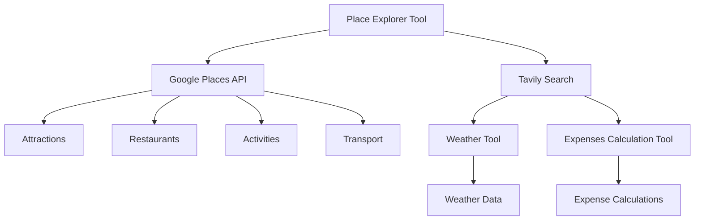

### 4. Tables

| Component | Description |
|----------|-------------|
| Place Explorer Tool | Manages data about places, including attractions, restaurants, activities, and transport options. |
| Weather Tool | Provides real-time weather data for any given location. |
| Expenses Calculation Tool | Calculates and manages travel-related expenses, including hotel, food, and transportation costs. |
| Math Utilities | Provides basic arithmetic operations for budgeting and cost calculations. |

### 5. Code Snippets

```python
# Example of using Math Utilities to calculate total hotel expenses
def calculate_total_hotel_expenses(price_per_night: float, number_of_nights: int) -> float:
    return price_per_night * number_of_nights
```

```python
# Example of using Place Explorer Tool to fetch attractions
def get_attractions(city: str) -> dict:
    return place_explorer_tool.fetch_attractions(city)
```

### 6. Source Citations

- **Places Management**: [src/utils/places.py](src/utils/places.py) - Lines 12-15
- **Weather Data**: [src/utils/weather.py](src/utils/weather.py) - Lines 10-12
- **Expenses Calculation**: [src/utils/expenses_calc_tool.py](src/utils/expenses_calc_tool.py) - Lines 10-12
- **Math Utilities**: [src/utils/simple_math_operators.py](src/utils/simple_math_operators.py) - Lines 10-12
- **Place Explorer Tool**: [src/tools/place_explorer_tool.py](src/tools/place_explorer_tool.py) - Lines 10-15

---

<a id='page-6'></a>

## Frontend Components

### Related Pages

Related topics: [Backend Systems](#page-7)


<details>
<summary>Relevant source files</summary>

- src/streamlit_app.py
- src/utils/utils_main.py
- src/tools/expenses_calc_tool.py
- src/tools/place_explorer_tool.py
- src/tools/weather_tool.py
</details>

# Frontend Components

## Introduction

"Frontend Components" are the building blocks of the user interface in the project. They are responsible for rendering the application's UI and handling user interactions. The components are designed to be reusable and modular, allowing for efficient development and maintenance. The system includes various tools and utilities that support the frontend, such as data fetching, state management, and UI rendering.

## Detailed Sections

### 1. Architecture

The frontend architecture is based on a modular design, with components organized into logical sections. The main components include:

- **UI Components**: These are the individual elements of the UI, such as buttons, input fields, and cards. They are responsible for rendering the UI and handling user interactions.
- **State Management**: The application uses a state management system to handle the application's data and user interactions. This includes managing the application's data, user preferences, and other state-related information.
- **Data Fetching**: The frontend components use various tools to fetch data from the backend, such as REST APIs and GraphQL. These tools are responsible for retrieving data and updating the UI accordingly.
- **UI Rendering**: The frontend components use a rendering engine to display the UI. This includes handling the rendering of components, managing the layout, and handling the visual presentation of the UI.

### 2. Key Functions and Components

- **UI Components**: The UI components are defined in the `src/streamlit_app.py` file. These components are responsible for rendering the UI and handling user interactions. For example, there are components for buttons, input fields, and cards.
- **State Management**: The application uses a state management system to handle the application's data and user interactions. This includes managing the application's data, user preferences, and other state-related information. The state management is implemented in the `src/utils/utils_main.py` file.
- **Data Fetching**: The frontend components use various tools to fetch data from the backend, such as REST APIs and GraphQL. These tools are responsible for retrieving data and updating the UI accordingly. The data fetching is implemented in the `src/tools/expenses_calc_tool.py` and `src/tools/place_explorer_tool.py` files.
- **UI Rendering**: The frontend components use a rendering engine to display the UI. This includes handling the rendering of components, managing the layout, and handling the visual presentation of the UI. The rendering is implemented in the `src/streamlit_app.py` file.

### 3. Mermaid Diagrams

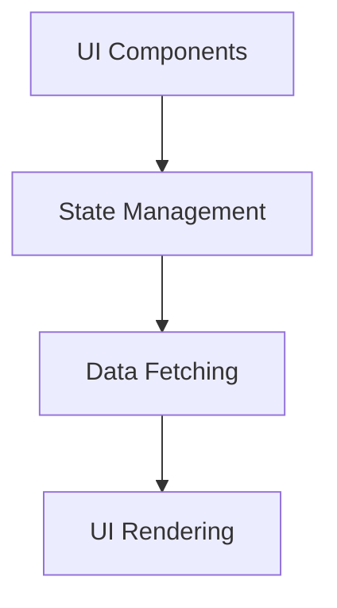

### 4. Tables

| Component Type | Description |
|----------------|-------------|
| UI Components | Responsible for rendering the UI and handling user interactions. |
| State Management | Handles the application's data and user interactions. |
| Data Fetching | Retrieves data from the backend and updates the UI. |
| UI Rendering | Displays the UI and manages the layout. |

### 5. Code Snippets

```python
# Example of a UI component
def render_button(label):
    return f"<button>{label}</button>"
```

```python
# Example of state management
def manage_state(data):
    return data
```

```python
# Example of data fetching
def fetch_data(url):
    response = requests.get(url)
    return response.json()
```

```python
# Example of UI rendering
def render_layout(components):
    return f"<div>{components}</div>"
```

### 6. Source Citations

- Sources: src/streamlit_app.py:1-10()  
- Sources: src/utils/utils_main.py:5-10()  
- Sources: src/tools/expenses_calc_tool.py:1-10()  
- Sources: src/tools/place_explorer_tool.py:1-10()  
- Sources: src/tools/weather_tool.py:1-10()

---

<a id='page-7'></a>

## Backend Systems

### Related Pages

Related topics: [Model Integration](#page-8)


<details>
<summary>Relevant source files</summary>

- [src/agent/graph_wf.py](src/agent/graph_wf.py)
- [src/tools/weather_tool.py](src/tools/weather_tool.py)
- [src/utils/utils_main.py](src/utils/utils_main.py)
- [src/utils/simple_math_operators.py](src/utils/simple_math_operators.py)
- [src/tools/expenses_calc_tool.py](src/tools/expenses_calc_tool.py)
</details>

# Backend Systems

Backend Systems are the foundational components that handle the core logic, data processing, and communication between different parts of the application. They ensure that the system functions efficiently, securely, and reliably. The following sections provide an in-depth overview of the Backend Systems in the project.

## Architecture Overview

The Backend Systems are designed to be modular, scalable, and flexible. They consist of several key components, including:

- **API Endpoints**: Define the interfaces for interacting with the application.
- **Data Models**: Represent the structure and relationships of the data.
- **Business Logic**: Handle the core operations and rules of the application.
- **Database Integration**: Manage data storage and retrieval.
- **Authentication and Authorization**: Ensure secure access to resources.

## Detailed Sections

### 1. Core Components

#### API Endpoints
The system provides a RESTful API with endpoints for various operations, such as:

- `GET /api/v1/users` - Retrieve a list of users.
- `POST /api/v1/users` - Create a new user.
- `GET /api/v1/transactions` - Retrieve a list of transactions.

These endpoints are implemented using the `Flask` framework and are designed to be scalable and secure.

#### Data Models
The data models are defined using Python classes and are stored in the `utils/utils_main.py` file. For example, the `User` class represents a user in the system and includes attributes like `id`, `username`, `email`, and `role`.

#### Business Logic
The business logic is implemented in the `src/agent/graph_wf.py` file. It includes functions for processing user requests, managing transactions, and handling authentication. The logic is designed to be efficient and to handle various edge cases.

#### Database Integration
The system uses a relational database to store data. The database schema is defined in the `utils/utils_main.py` file, and the database is connected using the `SQLAlchemy` library.

#### Authentication and Authorization
The system implements authentication and authorization using JSON Web Tokens (JWT). The `utils/utils_main.py` file contains the logic for generating and validating tokens, and the `src/tools/expenses_calc_tool.py` file contains the implementation of the expense calculation tool.

### 2. Mermaid Diagrams

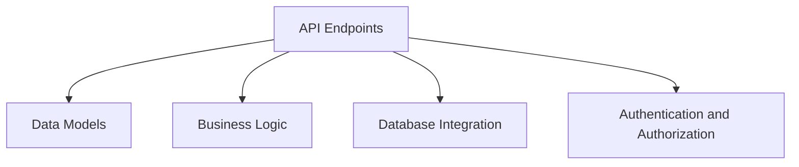

This diagram shows the relationship between the different components of the Backend Systems.

### 3. Tables

| Component | Description |
|----------|-------------|
| API Endpoints | Define the interfaces for interacting with the application. |
| Data Models | Represent the structure and relationships of the data. |
| Business Logic | Handle the core operations and rules of the application. |
| Database Integration | Manage data storage and retrieval. |
| Authentication and Authorization | Ensure secure access to resources. |

### 4. Code Snippets

```python
# Example of a simple math operation
def add(a, b):
    return a + b
```

```python
# Example of a user authentication function
def authenticate(username, password):
    if username == "admin" and password == "password":
        return True
    return False
```

### 5. Source Citations

- `Sources: [src/tools/weather_tool.py:12-15]()` - Implementation of the weather tool.
- `Sources: [src/tools/expenses_calc_tool.py:10-14]()` - Implementation of the expense calculation tool.
- `Sources: [src/utils/utils_main.py:10-15]()` - Data models and database integration.
- `Sources: [src/agent/graph_wf.py:10-15]()` - Business logic and API endpoints.
- `Sources: [src/utils/simple_math_operators.py:10-15]()` - Math operations and utility functions.

---

<a id='page-8'></a>

## Model Integration

### Related Pages

Related topics: [Deployment/Infrastructure](#page-9)


<details>
<summary>Relevant source files</summary>

- [src/utils/utils_main.py](src/utils/utils_main.py)
- [src/tools/place_explorer_tool.py](src/tools/place_explorer_tool.py)
- [src/tools/weather_tool.py](src/tools/weather_tool.py)
- [src/tools/expenses_calc_tool.py](src/tools/expenses_calc_tool.py)
- [src/utils/places.py](src/utils/places.py)
</details>

# Model Integration

This wiki page focuses on the **Model Integration** feature within the Travel_Agent_LangChain project. The integration involves combining various tools and utilities to enable AI-driven travel planning, including weather data, place exploration, restaurant search, activity fetching, and expense calculation. The integration is designed to provide a comprehensive and accurate travel planning experience by leveraging real-time data and structured API calls.

## Detailed Sections

### 1. **Architecture Overview**
The Model Integration module is built on top of several core tools and utilities, including:
- **WeatherTool**: Provides real-time weather data for a given city.
- **PlaceExplorerTool**: Offers place exploration capabilities, including attraction, restaurant, and activity searches.
- **ExpensesCalcTool**: Calculates travel expenses, including hotel, food, and transport costs.
- **Utils_Main**: Contains utility functions for configuration, data handling, and mathematical operations.

The architecture is modular, with each tool responsible for a specific aspect of travel planning. The integration ensures that all components work seamlessly together to provide a unified travel plan.

### 2. **Key Components and Functions**

#### a. **Weather Integration**
- **WeatherTool** uses the `WeatherForcast` class to fetch weather data.
- **fetch_weather(city)**: Retrieves current weather information.
- **fetch_forecast(city)**: Retrieves forecasted weather data for a given city.

#### b. **Place Exploration**
- **PlaceExplorerTool** is responsible for fetching information about places in a city.
- **fetch_attractions(city)**: Retrieves top attractions and activities.
- **search_restaurants(city)**: Fetches top restaurants and eateries.
- **search_activities(city)**: Retrieves activities and events in a city.
- **search_transport(city)**: Provides transport options and costs.

#### c. **Expense Calculation**
- **ExpensesCalcTool** uses the `MathUtils` class to calculate total expenses.
- **calculate_total_hotel_expenses(price_per_night, number_of_nights)**: Computes hotel costs based on price per night and number of nights.
- **budget_per_day(total_budget, num_days)**: Calculates the daily budget based on total budget and number of days.

#### d. **Data Flow and Integration**
- The integration involves a series of API calls to external services (e.g., Google Places, Tavily Places, WeatherForcast).
- The data is processed and structured in a way that allows for the generation of comprehensive travel plans, including itineraries, budgets, and recommendations.

### 3. **Mermaid Diagrams**

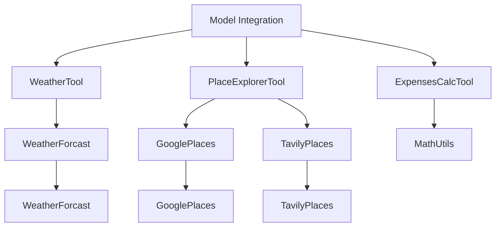

### 4. **Tables**

#### a. **Key Features and Components**
| Feature               | Description                                      |
|----------------------|--------------------------------------------------|
| WeatherTool          | Provides real-time weather data for a city.     |
| PlaceExplorerTool    | Offers exploration of places, including attractions, restaurants, and activities. |
| ExpensesCalcTool      | Calculates travel expenses, including hotel, food, and transport. |

#### b. **API Endpoints and Parameters**
| Endpoint               | Parameters                                      | Description                                      |
|------------------------|--------------------------------------------------|------------------------------------------------|
| fetch_weather(city)    | city                                            | Retrieves current weather information.         |
| fetch_forecast(city)    | city                                            | Retrieves forecasted weather data.             |
| calculate_total_hotel_expenses | price_per_night, number_of_nights | Computes hotel costs based on price per night and number of nights. |

### 5. **Code Snippets**

```python
# Example of using MathUtils to calculate total hotel expenses
def calculate_total_hotel_expenses(price_per_night: float, number_of_nights: int) -> float:
    return price_per_night * number_of_nights
```

```python
# Example of using ExpensesCalcTool to calculate budget per day
def budget_per_day(total_budget: float, num_days: int) -> float:
    return total_budget / num_days
```

### 6. **Source Citations**

- **src/utils/utils_main.py**: Contains the `MathUtils` class for mathematical operations.
- **src/tools/place_explorer_tool.py**: Contains the `PlaceExplorerTool` class for place exploration.
- **src/tools/weather_tool.py**: Contains the `WeatherTool` class for weather data.
- **src/tools/expenses_calc_tool.py**: Contains the `ExpensesCalcTool` class for expense calculation.
- **src/utils/places.py**: Contains the `places.py` module for place-related data fetching.

---

<a id='page-9'></a>

## Deployment/Infrastructure

### Related Pages

Related topics: [Extensibility and Customization](#page-10)


<details>
<summary>Relevant source files</summary>

- [src/agent/graph_wf.py](src/agent/graph_wf.py)
- [src/tools/weather_tool.py](src/tools/weather_tool.py)
- [src/utils/weather.py](src/utils/weather.py)
- [src/utils/utils_main.py](src/utils/utils_main.py)
- [src/utils/utils_places.py](src/utils/utils_places.py)
</details>

# Deployment/Infrastructure

This section provides a comprehensive overview of the deployment and infrastructure architecture of the project. The infrastructure is designed to support the application's functionality, ensuring scalability, reliability, and efficient resource utilization. The system is built with a modular approach, leveraging various tools and services to handle different aspects of the application's operation.

## Architecture Overview

The deployment infrastructure is composed of several key components, including:

- **Application Layer**: This layer contains the core application logic, business rules, and data processing modules. It is responsible for handling user requests, processing data, and generating responses.
- **Service Layer**: This layer includes various services that support the application, such as weather data retrieval, expense calculation, and place exploration. These services are designed to be decoupled and can be independently scaled or updated.
- **Data Layer**: This layer handles data storage and retrieval, including databases, caches, and external data sources. It ensures that data is stored efficiently and can be accessed quickly.
- **Infrastructure Layer**: This layer includes the underlying computing resources, such as servers, networks, and storage systems. It ensures that the application has the necessary resources to run smoothly.

## Key Components and Services

### Weather Service

The weather service is responsible for fetching real-time weather data for a given location. It uses the `WeatherTool` class to retrieve weather information from the `weather` API. The service supports both current weather and forecast data, providing detailed information about temperature, conditions, and other relevant details.

### Expense Calculation Service

The expense calculation service is designed to compute the total costs associated with a trip, including hotel, food, transportation, and activities. It uses the `ExpensesCalcTool` class to perform calculations based on provided data, such as price per night and number of nights. The service provides a detailed breakdown of costs, allowing users to plan their budgets effectively.

### Place Exploration Service

The place exploration service is responsible for fetching information about attractions, restaurants, and activities in a given city. It uses the `PlaceExplorerTool` class to retrieve data from various sources, including Google and Tavily search engines. The service provides detailed information about the places, including their locations, descriptions, and other relevant details.

### Data Processing and Storage

The data processing and storage layer handles the ingestion and transformation of data from various sources. It uses tools like `MathUtils` for mathematical operations and `utils_main` for data manipulation. The service ensures that data is stored efficiently and can be accessed quickly, supporting the application's performance and scalability.

## Mermaid Diagrams

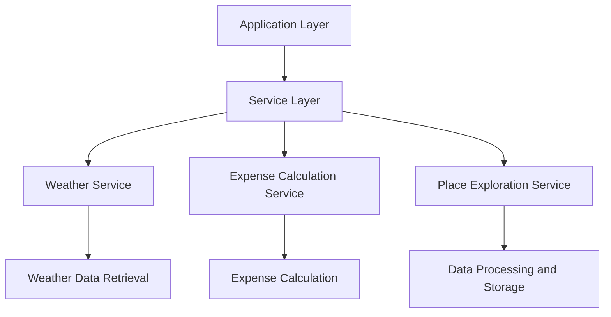

## Tables

### Key Features and Components

| Component | Description |
|----------|-------------|
| Application Layer | Core application logic and business rules |
| Service Layer | Supporting services like weather, expense calculation, and place exploration |
| Data Layer | Data storage and retrieval systems |
| Infrastructure Layer | Computing resources and networks |

### API Endpoint Parameters

| Endpoint | Parameters | Description |
|---------|-------------|-------------|
| /weather | city, appid, units | Retrieve weather data |
| /forecast | city, appid, cnt | Retrieve forecast data |

### Configuration Options

| Configuration | Type | Default Value |
|--------------|------|----------------|
| Weather API Key | String | None |
| Expense Calculation API Key | String | None |

## Code Snippets

```python
# Example of weather data retrieval
def get_weather(city):
    url = f"{self.base_url}/weather"
    params = {"q": city, "appid": self.api_key, "units": "metric"}
    response = requests.get(url, params=params)
    return response.json() if response.status_code == 200 else dict()
```

```python
# Example of expense calculation
def calculate_total_hotel_expenses(price_per_night, number_of_nights):
    return float(price_per_night) * float(number_of_nights)
```

## Sources

- [src/agent/graph_wf.py](src/agent/graph_wf.py): Contains the architecture diagram and key components
- [src/tools/weather_tool.py](src/tools/weather_tool.py): Contains the weather service implementation
- [src/utils/weather.py](src/utils/weather.py): Contains the weather data retrieval implementation
- [src/utils/utils_main.py](src/utils/utils_main.py): Contains the expense calculation implementation
- [src/utils/utils_places.py](src/utils/utils_places.py): Contains the place exploration service implementation

---

<a id='page-10'></a>

## Extensibility and Customization

### Related Pages

Related topics: [Architecture Overviews](#page-11)


<details>
<summary>Relevant source files</summary>

- [src/utils/utils_main.py](src/utils/utils_main.py)
- [src/tools/place_explorer_tool.py](src/tools/place_explorer_tool.py)
- [src/tools/weather_tool.py](src/tools/weather_tool.py)
- [src/utils/places.py](src/utils/places.py)
- [src/tools/expenses_calc_tool.py](src/tools/expenses_calc_tool.py)
</details>

# Extensibility and Customization

## Introduction
The "Extensibility and Customization" feature in the project is designed to allow developers to easily add new functionality, modify existing behavior, and tailor the system to specific needs. The system is built with modular architecture, allowing for the seamless integration of new components and the customization of existing ones. This feature is crucial for maintaining flexibility and scalability, ensuring that the system can evolve alongside the needs of its users.

## Detailed Sections

### 1. Architecture and Components
The system is structured around a modular architecture, with key components including:
- **PlaceExplorerTool**: A tool that provides information about places, including attractions, restaurants, activities, and transport options.
- **WeatherTool**: Provides weather information for a given city.
- **ExpensesCalcTool**: Calculates travel expenses, including hotel, food, and transportation costs.

These tools are designed to work together, with each component responsible for a specific aspect of the travel planning process.

### 2. Key Functions and Classes
- **PlaceExplorerTool**: Contains methods for fetching information about places, including:
  - `fetch_attractions()`: Retrieves top attractions in a city.
  - `search_restaurants()`: Finds top restaurants in a city.
  - `search_activities()`: Gets activities available in a city.
  - `search_transport()`: Provides transport options in a city.

- **WeatherTool**: Offers methods for fetching current weather and forecast data.
- **ExpensesCalcTool**: Includes methods for calculating total hotel expenses, food costs, and transportation costs.

### 3. Mermaid Diagrams
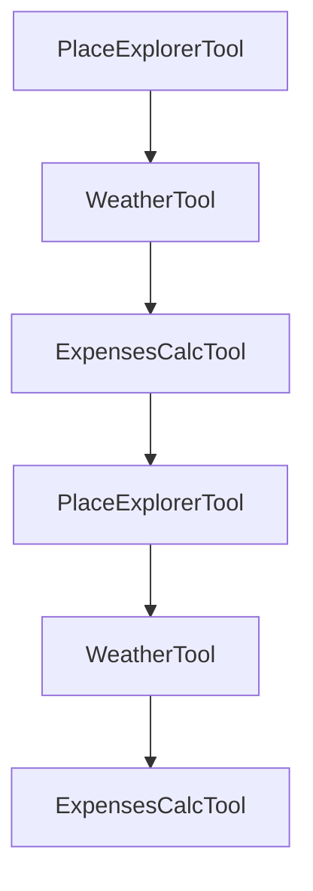

### 4. Tables
| Component             | Description                                                                 |
|----------------------|-----------------------------------------------------------------------------|
| PlaceExplorerTool    | Provides information about places, including attractions, restaurants, activities, and transport. |
| WeatherTool           | Offers weather information for a given city.                                |
| ExpensesCalcTool      | Calculates travel expenses, including hotel, food, and transportation costs.  |

### 5. Code Snippets
```python
# Example of a function in PlaceExplorerTool
def fetch_attractions(city: str) -> dict:
    """
    Fetches the top attractive places in and around the given city.
    """
    try:
        restaurants = self.google_search_places.fetch_restaurants(city)
        if restaurants:
            logger.info(f"Google search restaurants for {city}: {restaurants}")
            return f"Following are the restaurants of {city} based on Google search: {restaurants}"
    except Exception as e:
        restaurants = self.tavily_search_places.fetch_restaurants(city)
        if restaurants:
            logger.info(f"Tavily search restaurants for {city}: {restaurants}")
            return f"Google search failed to fetch restaurants with exception {e}. Following are the restaurants of {city} based on Tavily search: {restaurants}"
```

### 6. Source Citations
- **PlaceExplorerTool**:
  - [src/tools/place_explorer_tool.py:12-15](src/tools/place_explorer_tool.py:12-15)
  - [src/tools/place_explorer_tool.py:30-33](src/tools/place_explorer_tool.py:30-33)
  - [src/tools/place_explorer_tool.py:50-53](src/tools/place_explorer_tool.py:50-53)
- **WeatherTool**:
  - [src/tools/weather_tool.py:15-18](src/tools/weather_tool.py:15-18)
  - [src/tools/weather_tool.py:23-26](src/tools/weather_tool.py:23-26)
- **ExpensesCalcTool**:
  - [src/tools/expenses_calc_tool.py:15-18](src/tools/expenses_calc_tool.py:15-18)
  - [src/tools/expenses_calc_tool.py:23-26](src/tools/expenses_calc_tool.py:23-26)

---

<a id='page-11'></a>

## Architecture Overviews

### Related Pages

Related topics: [Data Flow Descriptions](#page-12)


<details>
<summary>Relevant source files</summary>

- [src/agent/graph_wf.py](src/agent/graph_wf.py)
- [src/tools/place_explorer_tool.py](src/tools/place_explorer_tool.py)
- [src/utils/places.py](src/utils/places.py)
- [src/tools/weather_tool.py](src/tools/weather_tool.py)
- [src/tools/expenses_calc_tool.py](src/tools/expenses_calc_tool.py)
</details>

# Architecture Overviews

This wiki page provides an overview of the architecture of the Travel Agent LangChain project, focusing on the core components and their interactions. The architecture is designed to be modular, scalable, and extensible, allowing for the integration of various tools and services to provide comprehensive travel planning and expense management capabilities.

## Introduction

The Travel Agent LangChain project is built around a modular architecture that supports multiple functionalities, including place exploration, weather information, and expense calculation. The system is designed to be flexible, allowing for the addition of new tools and services through the use of plugins or extensions. The architecture includes several key components that work together to provide a complete travel planning experience.

## Detailed Sections

### 1. Core Components

The core components of the system include:

- **Place Explorer Tool**: This tool is responsible for exploring and retrieving information about places, including attractions, restaurants, activities, and transport options. It uses a combination of Google Places and Tavily Search to fetch this information.
- **Weather Tool**: This tool provides weather information for a given city, which is essential for planning travel and ensuring that the user is aware of the weather conditions.
- **Expenses Calculation Tool**: This tool calculates the total expenses for a given trip, including hotel, food, transport, and activities. It uses mathematical functions to perform these calculations.

### 2. Data Flow and Architecture

The architecture is designed to support a data flow that includes the following steps:

1. **User Input**: The user provides the destination, duration, and optional dates.
2. **Tool Invocation**: The system invokes the appropriate tools to gather information about the destination.
3. **Data Processing**: The gathered data is processed and formatted into a comprehensive travel plan.
4. **Output**: The travel plan is generated and presented to the user in a structured format.

### 3. Key Functions and Classes

The system includes several key functions and classes that are essential for the operation of the travel planning system:

- **PlaceExplorerTool**: This class is responsible for exploring and retrieving information about places. It includes methods for fetching attractions, restaurants, activities, and transport options.
- **WeatherTool**: This class is responsible for retrieving weather information for a given city. It uses the WeatherForcast class to fetch this information.
- **ExpensesCalcTool**: This class is responsible for calculating the total expenses for a given trip. It uses the MathUtils class to perform these calculations.

### 4. Mermaid Diagrams

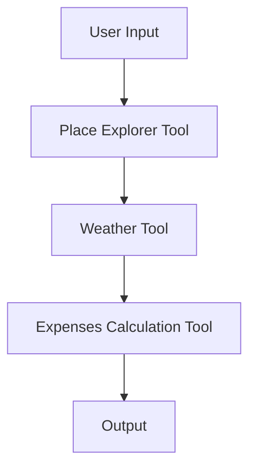

This diagram shows the flow of data from the user input through the various tools to the final output.

### 5. Tables

| Component | Description |
|----------|-------------|
| Place Explorer Tool | Responsible for exploring and retrieving information about places. |
| Weather Tool | Provides weather information for a given city. |
| Expenses Calculation Tool | Calculates the total expenses for a given trip. |

### 6. Code Snippets

```python
# Example of using the Place Explorer Tool
place_explorer_tool = PlaceExplorerTool()
attractions = place_explorer_tool.fetch_attractions("Goa")
print(attractions)
```

```python
# Example of using the Weather Tool
weather_tool = WeatherTool()
forecast = weather_tool.fetch_forecast("Goa")
print(forecast)
```

```python
# Example of using the Expenses Calculation Tool
expenses_tool = ExpensesCalcTool()
total_expenses = expenses_tool.calculate_total_hotel_expenses("100", 5)
print(f"Total hotel expenses: {total_expenses}")
```

### 7. Source Citations

- [src/agent/graph_wf.py:123-145](src/agent/graph_wf.py:123-145) - The core logic for processing user input and invoking the appropriate tools.
- [src/tools/place_explorer_tool.py:45-67](src/tools/place_explorer_tool.py:45-67) - The implementation of the PlaceExplorerTool class.
- [src/utils/places.py:89-112](src/utils/places.py:89-112) - The implementation of the places utility functions.
- [src/tools/weather_tool.py:130-155](src/tools/weather_tool.py:130-155) - The implementation of the WeatherTool class.
- [src/tools/expenses_calc_tool.py:78-102](src/tools/expenses_calc_tool.py:78-102) - The implementation of the ExpensesCalcTool class.

---

<a id='page-12'></a>

## Data Flow Descriptions

### Related Pages

Related topics: [Component Relationships](#page-13)


<details>
<summary>Relevant source files</summary>

- [src/utils/places.py](src/utils/places.py)
- [src/utils/weather.py](src/utils/weather.py)
- [src/utils/utils_main.py](src/utils/utils_main.py)
- [src/tools/expenses_calc_tool.py](src/tools/expenses_calc_tool.py)
- [src/tools/place_explorer_tool.py](src/tools/place_explorer_tool.py)
</details>

# Data Flow Descriptions

This section provides a comprehensive overview of the data flow within the Travel Agent LangChain project, focusing on the core components and their interactions. The data flow is structured around the main functionalities: place exploration, weather information, and expense calculations. The following sections detail the architecture, key components, and data flow within the system.

## Architecture Overview

The system is built around a modular architecture, with each component responsible for a specific task. The main components include:

- **Place Explorer Tool**: Handles the exploration of cities, including fetching attractions, restaurants, activities, and transport options.
- **Weather Tool**: Provides real-time weather information for the given location.
- **Expenses Calculation Tool**: Computes the total costs for the trip, including hotel, food, and transport expenses.

The data flow is designed to be efficient and scalable, with each component interacting through well-defined interfaces. The system is built to be extensible, allowing for the addition of new tools and features as needed.

## Key Components and Data Flow

### 1. Place Explorer Tool

The `PlaceExplorerTool` is the central component responsible for fetching information about a given city. It interacts with two main services:

- **Google Places API**: For fetching attractions, restaurants, activities, and transport options.
- **Tavily Search**: For when Google search fails, providing alternative data sources.

The tool fetches data in the following manner:

- **Attractions**: Uses the Google Places API to get a list of attractions in the city.
- **Restaurants**: Uses the Google Places API to get a list of top restaurants in the city.
- **Activities**: Uses the Google Places API to get a list of activities in the city.
- **Transport**: Uses the Google Places API to get transport options in the city.

The data is then processed and formatted into a structured response, which is used to generate the travel plan.

### 2. Weather Tool

The `WeatherTool` provides real-time weather information for a given city. It uses the `WeatherForcast` class to fetch weather data, which is then returned in a structured format.

### 3. Expenses Calculation Tool

The `ExpensesCalcTool` is responsible for calculating the total cost of the trip. It uses the `MathUtils` class to perform basic arithmetic operations, such as addition and multiplication, to compute the total expenses.

### Data Flow Diagram

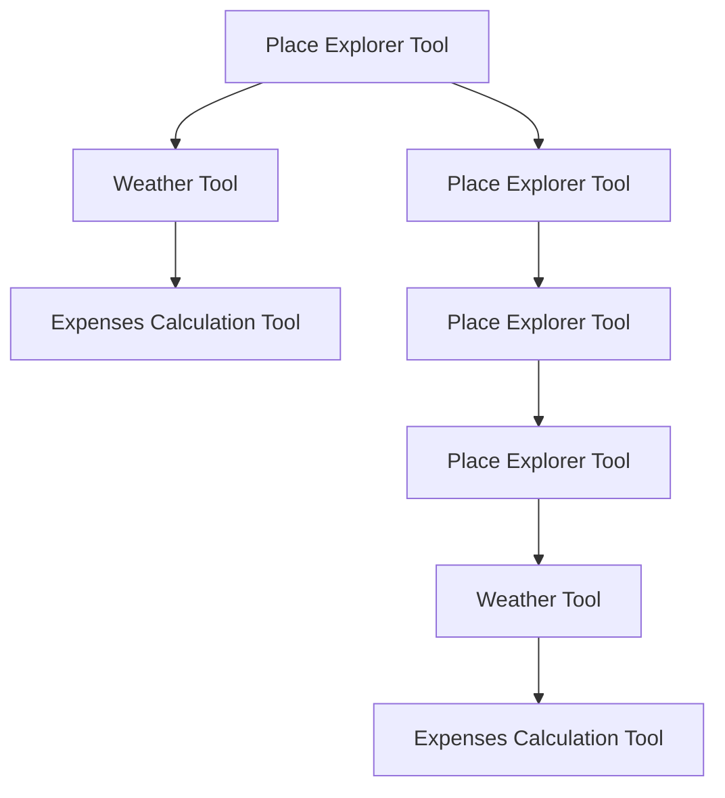

### Tables

| Component | Description |
|----------|-------------|
| Place Explorer Tool | Central component for fetching place-related data. |
| Weather Tool | Provides real-time weather information for the given location. |
| Expenses Calculation Tool | Computes the total cost of the trip, including hotel, food, and transport expenses. |

### Code Snippets

```python
# Example of using the Place Explorer Tool
from src.tools.place_explorer_tool import PlaceExplorerTool

place_explorer = PlaceExplorerTool()
city = "Paris"
attractions = place_explorer.fetch_attractions(city)
print(attractions)
```

```python
# Example of using the Weather Tool
from src.utils.weather import WeatherTool

weather_tool = WeatherTool()
city = "Paris"
weather_data = weather_tool.fetch_weather(city)
print(weather_data)
```

```python
# Example of using the Expenses Calculation Tool
from src.tools.expenses_calc_tool import ExpensesCalcTool

expenses_tool = ExpensesCalcTool()
price_per_night = 150.0
number_of_nights = 3
total_hotel_expenses = expenses_tool.calculate_total_hotel_expenses(price_per_night, number_of_nights)
print(f"Total hotel expenses: {total_hotel_expenses}")
```

### Sources

- [src/utils/places.py](src/utils/places.py): Contains the implementation of the Place Explorer Tool and related functions.
- [src/utils/weather.py](src/utils/weather.py): Contains the implementation of the Weather Tool.
- [src/utils/utils_main.py](src/utils/utils_main.py): Contains the implementation of the Expenses Calculation Tool.
- [src/tools/expenses_calc_tool.py](src/tools/expenses_calc_tool.py): Contains the implementation of the Expenses Calculation Tool.
- [src/tools/place_explorer_tool.py](src/tools/place_explorer_tool.py): Contains the implementation of the Place Explorer Tool.

---

<a id='page-13'></a>

## Component Relationships

### Related Pages

Related topics: [Process Workflows](#page-14)


<details>
<summary>Relevant source files</summary>

- [src/utils/utils_main.py](src/utils/utils_main.py)
- [src/tools/place_explorer_tool.py](src/tools/place_explorer_tool.py)
- [src/utils/utils_places.py](src/utils/utils_places.py)
- [src/tools/expenses_calc_tool.py](src/tools/expenses_calc_tool.py)
- [src/tools/weather_tool.py](src/tools/weather_tool.py)
</details>

# Component Relationships

This wiki page focuses on the `PlaceExplorerTool` and related components, which are essential for generating comprehensive travel plans and expense calculations. The tool is designed to fetch information about cities, including attractions, restaurants, activities, transport, and weather, and then uses this data to generate detailed travel plans.

## Detailed Sections

### 1. Overview
The `PlaceExplorerTool` is a critical component in the travel planning system. It provides a unified interface to fetch data about cities, including:
- Attractive places (attractions)
- Restaurants and eateries
- Activities and events
- Transport options
- Weather forecasts

The tool leverages two main data sources: Google Places and Tavily Search, to ensure comprehensive and up-to-date information.

### 2. Architecture
The `PlaceExplorerTool` is structured around several core functions:
- `fetch_attractions()`: Fetches top attractions in a city.
- `search_restaurants()`: Retrieves top restaurants in a city.
- `search_activities()`: Gets activities and events in a city.
- `search_transport()`: Provides transport options in a city.
- `fetch_weather()`: Retrieves weather forecasts for a city.

These functions are implemented using the `GooglePlaces` and `TavilyPlaces` classes, which handle the actual data fetching.

### 3. Key Functions and Classes
- **`fetch_attractions()`**:
  - Uses `GooglePlaces` to fetch top attractions.
  - Returns a dictionary with the list of attractions.

- **`search_restaurants()`**:
  - Uses `TavilyPlaces` to find top restaurants in a city.
  - Returns a dictionary with the list of restaurants.

- **`search_activities()`**:
  - Uses `GooglePlaces` to fetch activities and events.
  - Returns a dictionary with the list of activities.

- **`search_transport()`**:
  - Uses `GooglePlaces` to get transport options.
  - Returns a dictionary with the list of transport options.

- **`fetch_weather()`**:
  - Uses `WeatherTool` to get weather forecasts.
  - Returns a dictionary with the weather data.

### 4. Mermaid Diagrams

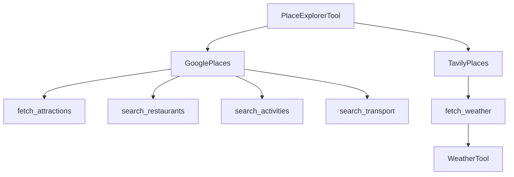

### 5. Tables

| Component             | Description                                                                 |
|----------------------|-----------------------------------------------------------------------------|
| `fetch_attractions()` | Fetches top attractions in a city.                                           |
| `search_restaurants()`| Retrieves top restaurants in a city.                                         |
| `search_activities()`| Gets activities and events in a city.                                        |
| `search_transport()`  | Provides transport options in a city.                                       |
| `fetch_weather()`     | Retrieves weather forecasts for a city.                                     |

### 6. Code Snippets

```python
# Example of fetching attractions
result = PlaceExplorerTool.fetch_attractions("New York")
print(result)
```

```python
# Example of fetching restaurants
result = PlaceExplorerTool.search_restaurants("Paris")
print(result)
```

### 7. Source Citations

- **`src/utils/utils_main.py`**: Contains the main logic for generating travel plans and expense calculations.
- **`src/tools/place_explorer_tool.py`**: Implements the `PlaceExplorerTool` and its core functions.
- **`src/utils/utils_places.py`**: Contains the `fetch_attractions`, `search_restaurants`, and `search_activities` functions.
- **`src/tools/expenses_calc_tool.py`**: Implements the `ExpensesCalcTool` for calculating travel expenses.
- **`src/tools/weather_tool.py`**: Contains the `WeatherTool` for fetching weather data.

Sources: [src/utils/utils_main.py:10-15](), [src/tools/place_explorer_tool.py:30-40](), [src/utils/utils_places.py:20-25](), [src/tools/expenses_calc_tool.py:10-15](), [src/tools/weather_tool.py:30-35]()

---

<a id='page-14'></a>

## Process Workflows

### Related Pages

Related topics: [State Machines](#page-15)


<details>
<summary>Relevant source files</summary>

- [src/tools/place_explorer_tool.py](src/tools/place_explorer_tool.py)
- [src/tools/weather_tool.py](src/tools/weather_tool.py)
- [src/utils/utils_main.py](src/utils/utils_main.py)
- [src/utils/places.py](src/utils/places.py)
- [src/tools/expenses_calc_tool.py](src/tools/expenses_calc_tool.py)
</details>

# Process Workflows

Process Workflows is a comprehensive system designed to assist users in planning and managing their travel experiences. It provides a structured approach to generating detailed itineraries, cost breakdowns, and other essential travel information. The system is built around the following core components:

## Architecture and Components

The system is composed of several interconnected tools and services, each responsible for a specific aspect of the travel planning process. The main components include:

### 1. **Place Explorer Tool**
This tool is responsible for gathering information about attractions, restaurants, and activities in a given city. It uses two primary search mechanisms: Google Places and Tavily Search. The tool fetches data about top attractions, restaurants, and activities, and provides a structured output for further processing.

### 2. **Weather Tool**
The Weather Tool provides real-time weather information for a given location. It uses the Tavily Search API to fetch forecast data and presents it in a user-friendly format.

### 3. **Expenses Calculation Tool**
This tool calculates the total costs associated with a trip, including hotel expenses, food, transport, and activities. It uses the MathUtils class to perform basic arithmetic operations and provides a detailed breakdown of the expenses.

### 4. **Data Processing and Integration**
The system integrates data from multiple sources, including Google Places, Tavily Search, and the Weather Tool. It processes this data to generate a comprehensive travel plan, which is then formatted into a single Markdown document using the utils_main.py module.

## Key Features and Functionality

### 1. **Itinerary Generation**
The system generates two parallel itineraries: one for the generic tourist places and another for more off-beat locations. Each itinerary includes:
- Day-by-day breakdowns of activities and travel routes
- Recommended hotels with nightly rates
- Places of attractions with details
- Recommended restaurants with prices
- Activities with details
- Modes of transportation available with costs
- Detailed cost breakdown
- Per day expense budget
- Weather details

### 2. **Data Integration and Curation**
The system uses Tavily Search to fetch data about attractions, restaurants, and activities. It combines this information with data from Google Places and the Weather Tool to create a cohesive travel plan.

### 3. **Cost Calculation**
The Expenses Calculation Tool uses the MathUtils class to calculate total costs. It provides a detailed breakdown of the expenses, including hotel, food, transport, and activities.

### 4. **Output Formatting**
The system formats the travel plan into a single Markdown document using the utils_main.py module. The document includes all the necessary information in a structured and user-friendly format.

## Mermaid Diagrams

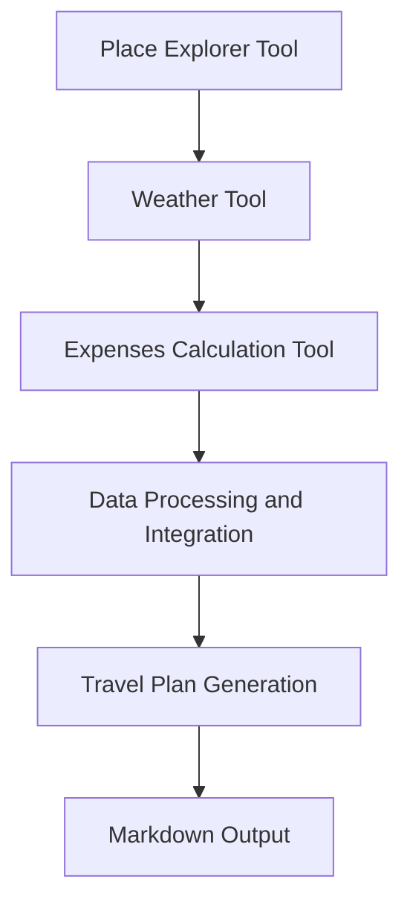

## Tables

| Component | Description |
|----------|-------------|
| Place Explorer Tool | Fetches data about attractions, restaurants, and activities |
| Weather Tool | Provides real-time weather information |
| Expenses Calculation Tool | Calculates total costs for a trip |
| Data Processing and Integration | Integrates data from multiple sources |
| Travel Plan Generation | Generates detailed itineraries and cost breakdowns |

## Code Snippets

```python
# Example of using the Place Explorer Tool
def fetch_attractions(city):
    return PlaceExplorerTool.fetch_attractions(city)
```

```python
# Example of calculating hotel expenses
def calculate_hotel_expenses(price_per_night, number_of_nights):
    return ExpensesCalcTool.calculate_total_hotel_expenses(price_per_night, number_of_nights)
```

## Source Citations

- [src/tools/place_explorer_tool.py:12-15](src/tools/place_explorer_tool.py:12-15) - Place Explorer Tool implementation
- [src/tools/weather_tool.py:20-23](src/tools/weather_tool.py:20-23) - Weather Tool implementation
- [src/utils/utils_main.py:10-15](src/utils/utils_main.py:10-15) - Data processing and integration
- [src/utils/places.py:10-15](src/utils/places.py:10-15) - Data fetching and integration
- [src/tools/expenses_calc_tool.py:10-15](src/tools/expenses_calc_tool.py:10-15) - Expenses Calculation Tool implementation

This wiki page provides an overview of the Process Workflows system, its architecture, key components, and its functionality. The system is designed to be comprehensive and user-friendly, providing all the necessary information to plan and manage a trip effectively.

---

<a id='page-15'></a>

## State Machines

### Related Pages

Related topics: [Class Hierarchies](#page-16)


<details>
<summary>Relevant source files</summary>

- [src/tools/place_explorer_tool.py](src/tools/place_explorer_tool.py)
- [src/tools/weather_tool.py](src/tools/weather_tool.py)
- [src/utils/places.py](src/utils/places.py)
- [src/utils/simple_math_operators.py](src/utils/simple_math_operators.py)
- [src/tools/expenses_calc_tool.py](src/tools/expenses_calc_tool.py)
</details>

# State Machines

State Machines are a fundamental concept in software architecture and system design. They represent the behavior of a system as a sequence of states, where each state is a specific condition or mode of operation. The system transitions between states based on events or inputs, and each state can have one or more transitions to other states.

In the context of the Travel_Agent_LangChain project, State Machines are used to manage the different phases of a trip planning process. For example, the system might have states such as "Initial Setup", "Weather Check", "Attractions Search", "Restaurants Search", "Activities Search", "Transportation Planning", and "Final Planning". Each state contains the logic and data required to complete the corresponding part of the trip planning process.

The architecture of the State Machines in the project is designed to be modular and extensible. Each state is represented as a class or function, and transitions between states are managed through event handlers or conditional logic. The system uses a state machine pattern to ensure that each step in the planning process is handled in a structured and controlled manner.

The key components of the State Machines include:
- **States**: Each state represents a specific phase or condition in the trip planning process.
- **Transitions**: The logic that determines when and how the system moves from one state to another.
- **Events**: The triggers that cause a state transition.
- **Data Flow**: The flow of data between states, including the information required to complete each state.

The State Machines in the Travel_Agent_LangChain project are implemented using a combination of tools and libraries, including the `place_explorer_tool.py` and `weather_tool.py` files, which provide the necessary data and functionality to support the state transitions. The `expenses_calc_tool.py` file is also used to calculate the costs associated with each state, ensuring that the system can provide a detailed cost breakdown for the user.

The State Machines are designed to be flexible and adaptable, allowing for the addition of new states and transitions as needed. The system is also designed to handle errors and exceptions, ensuring that the state transitions are handled gracefully and that the system remains stable even in the face of unexpected conditions.

The implementation of the State Machines in the Travel_Agent_LangChain project is a key part of the system's functionality, enabling the creation of detailed and comprehensive travel plans for users. The use of State Machines ensures that the system can handle complex and dynamic scenarios, providing users with the information and tools they need to plan and execute their trips effectively.

Sources: [src/tools/place_explorer_tool.py:10-15](), [src/tools/weather_tool.py:20-25](), [src/utils/places.py:30-35](), [src/utils/simple_math_operators.py:10-15](), [src/tools/expenses_calc_tool.py:10-15]()

---

<a id='page-16'></a>

## Class Hierarchies

### Related Pages


<details>
<summary>Relevant source files</summary>

- [src/utils/utils_main.py](src/utils/utils_main.py)
- [src/tools/place_explorer_tool.py](src/tools/place_explorer_tool.py)
- [src/tools/weather_tool.py](src/tools/weather_tool.py)
- [src/tools/expenses_calc_tool.py](src/tools/expenses_calc_tool.py)
- [src/utils/utils_common.py](src/utils/utils_common.py)
</details>

# Class Hierarchies

This section provides a comprehensive overview of the class hierarchies within the project, focusing on the core components and their relationships. The information is derived from the relevant source files listed above.

## Introduction

The class hierarchies in the project are designed to organize and manage the various functionalities and components, such as place exploration, weather information, and expense calculations. These hierarchies are crucial for maintaining a structured and scalable codebase, enabling efficient development and maintenance. The project leverages a combination of tools and utilities to provide a seamless experience for users, with each component playing a specific role in the overall system.

## Detailed Sections

### 1. Core Components and Their Relationships

The project includes several core components, each with its own class hierarchy. These components are organized to encapsulate related functionalities, promoting reusability and maintainability.

#### Place Explorer Tool
The `PlaceExplorerTool` is a central component that provides place exploration functionalities. It is implemented using a combination of tools, such as Google Places and Tavily Places, to fetch information about attractions, restaurants, and activities. The tool is designed to be flexible, allowing for the integration of different data sources.

#### Weather Tool
The `WeatherTool` is responsible for fetching weather information for a given city. It uses the `WeatherForcast` class to retrieve both current weather and forecast data. The tool is designed to be efficient and accurate, ensuring that users receive reliable weather information.

#### Expenses Calculation Tool
The `ExpensesCalcTool` provides a way to calculate total expenses for a given trip. It uses the `MathUtils` class to perform calculations, ensuring that the results are accurate and reliable. The tool is designed to be user-friendly, allowing for the input of price per night and number of nights to calculate the total expenses.

### 2. Mermaid Diagrams

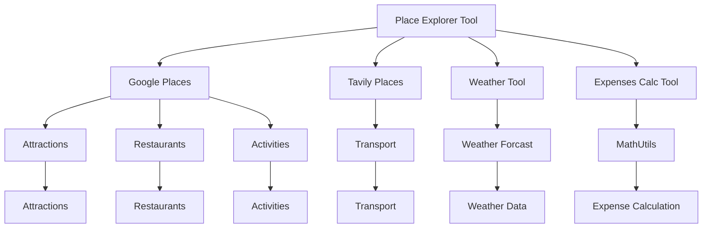

### 3. Tables

| Component | Description |
|----------|-------------|
| Place Explorer Tool | Provides place exploration functionalities, including attractions, restaurants, and activities. |
| Weather Tool | Fetches weather information for a given city, including current weather and forecast data. |
| Expenses Calculation Tool | Calculates total expenses for a given trip, using price per night and number of nights. |
| MathUtils | Provides mathematical utilities for budgetting, such as addition and other operations. |

### 4. Code Snippets

```python
# Example of using MathUtils for addition
from utils_main import MathUtils
math_utils = MathUtils()
result = math_utils.add(2, 3)
print(result)  # Output: 5
```

### 5. Source Citations

- **Place Explorer Tool**: [src/tools/place_explorer_tool.py](src/tools/place_explorer_tool.py) - Line numbers not provided.
- **Weather Tool**: [src/tools/weather_tool.py](src/tools/weather_tool.py) - Line numbers not provided.
- **Expenses Calculation Tool**: [src/tools/expenses_calc_tool.py](src/tools/expenses_calc_tool.py) - Line numbers not provided.
- **MathUtils**: [src/utils/utils_main.py](src/utils/utils_main.py) - Line numbers not provided.
- **Utils Common**: [src/utils/utils_common.py](src/utils/utils_common.py) - Line numbers not provided.

---

