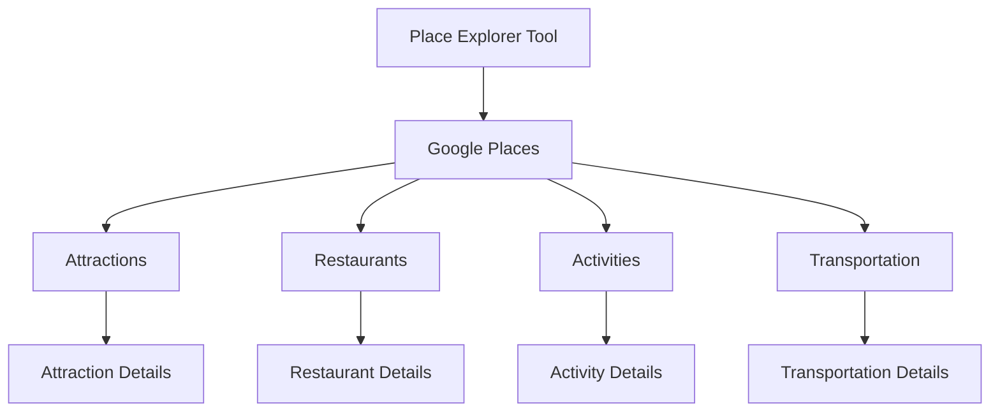

## README.md

### Related Pages

Related topics: [Overview](#page-2)


<details>
<summary>Relevant source files</summary>

- README.md
- constants.py
- src/tools/place_explorer_tool.py
- src/utils/utils_main.py
- src/tools/expenses_calc_tool.py
</details>

# README.md

This file serves as the main documentation for the Travel_Agent_LangChain project. It outlines the project's purpose, key components, and provides a comprehensive overview of the system's architecture and functionality.

## Detailed Sections

### Introduction
The Travel_Agent_LangChain project is designed to help users plan and book trips to any location worldwide with real-time data and detailed cost breakdowns. The system provides two parallel itineraries: one for classic tourist spots and another for off-beat locations. It includes features such as weather information, restaurant recommendations, activity listings, and transportation options, all formatted in a clean and user-friendly manner.

### Architecture and Components
The project is built around several key components:
- **Place Explorer Tool**: A tool that fetches information about attractions, restaurants, activities, and transportation for a given city.
- **Expenses Calculator Tool**: A tool that calculates the total costs for hotels, food, transportation, and activities.
- **Weather Tool**: Provides real-time weather information for the destination.
- **Math Utils**: A utility for basic mathematical operations to assist in budgeting and calculations.

### Key Functions and Classes
- **PlaceExplorerTool**: This class manages the retrieval of place-related data. It uses Google Places and Tavily Search to fetch information about attractions, restaurants, activities, and transportation.
- **ExpensesCalcTool**: This class handles the calculation of travel expenses. It uses the MathUtils class to perform basic arithmetic operations and aggregate the costs for the trip.
- **WeatherTool**: This tool fetches weather data for a given city using the WeatherForcast class.

### Mermaid Diagrams


### Tables
| Component | Description |
|----------|-------------|
| Place Explorer Tool | Manages the retrieval of place-related data. |
| Expenses Calculator Tool | Calculates the total costs for hotels, food, transportation, and activities. |
| Weather Tool | Provides real-time weather information for the destination. |
| Math Utils | A utility for basic mathematical operations to assist in budgeting and calculations. |

### Code Snippets
```python
# Example of using MathUtils to add two numbers
from utils_main import MathUtils
math_utils = MathUtils()
result = math_utils.add(2, 3)
print(result)  # Output: 5
```

### Source Citations
- **constants.py**: Contains the system prompt and configuration settings.
- **src/tools/place_explorer_tool.py**: Contains the implementation of the PlaceExplorerTool class.
- **src/utils/utils_main.py**: Contains the MathUtils class and the save_document function.
- **src/tools/expenses_calc_tool.py**: Contains the ExpensesCalcTool class and its implementation.
- **README.md**: Contains the detailed sections and structure of the documentation.

---

