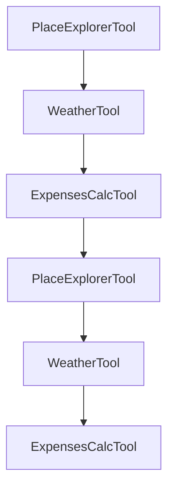

## Extensibility and Customization

### Related Pages

Related topics: [Architecture Overviews](#page-11)


<details>
<summary>Relevant source files</summary>

- [src/utils/utils_main.py](src/utils/utils_main.py)
- [src/tools/place_explorer_tool.py](src/tools/place_explorer_tool.py)
- [src/tools/weather_tool.py](src/tools/weather_tool.py)
- [src/utils/places.py](src/utils/places.py)
- [src/tools/expenses_calc_tool.py](src/tools/expenses_calc_tool.py)
</details>

# Extensibility and Customization

## Introduction
The "Extensibility and Customization" feature in the project is designed to allow developers to easily add new functionality, modify existing behavior, and tailor the system to specific needs. The system is built with modular architecture, allowing for the seamless integration of new components and the customization of existing ones. This feature is crucial for maintaining flexibility and scalability, ensuring that the system can evolve alongside the needs of its users.

## Detailed Sections

### 1. Architecture and Components
The system is structured around a modular architecture, with key components including:
- **PlaceExplorerTool**: A tool that provides information about places, including attractions, restaurants, activities, and transport options.
- **WeatherTool**: Provides weather information for a given city.
- **ExpensesCalcTool**: Calculates travel expenses, including hotel, food, and transportation costs.

These tools are designed to work together, with each component responsible for a specific aspect of the travel planning process.

### 2. Key Functions and Classes
- **PlaceExplorerTool**: Contains methods for fetching information about places, including:
  - `fetch_attractions()`: Retrieves top attractions in a city.
  - `search_restaurants()`: Finds top restaurants in a city.
  - `search_activities()`: Gets activities available in a city.
  - `search_transport()`: Provides transport options in a city.

- **WeatherTool**: Offers methods for fetching current weather and forecast data.
- **ExpensesCalcTool**: Includes methods for calculating total hotel expenses, food costs, and transportation costs.

### 3. Mermaid Diagrams


### 4. Tables
| Component             | Description                                                                 |
|----------------------|-----------------------------------------------------------------------------|
| PlaceExplorerTool    | Provides information about places, including attractions, restaurants, activities, and transport. |
| WeatherTool           | Offers weather information for a given city.                                |
| ExpensesCalcTool      | Calculates travel expenses, including hotel, food, and transportation costs.  |

### 5. Code Snippets
```python
# Example of a function in PlaceExplorerTool
def fetch_attractions(city: str) -> dict:
    """
    Fetches the top attractive places in and around the given city.
    """
    try:
        restaurants = self.google_search_places.fetch_restaurants(city)
        if restaurants:
            logger.info(f"Google search restaurants for {city}: {restaurants}")
            return f"Following are the restaurants of {city} based on Google search: {restaurants}"
    except Exception as e:
        restaurants = self.tavily_search_places.fetch_restaurants(city)
        if restaurants:
            logger.info(f"Tavily search restaurants for {city}: {restaurants}")
            return f"Google search failed to fetch restaurants with exception {e}. Following are the restaurants of {city} based on Tavily search: {restaurants}"
```

### 6. Source Citations
- **PlaceExplorerTool**:
  - [src/tools/place_explorer_tool.py:12-15](src/tools/place_explorer_tool.py:12-15)
  - [src/tools/place_explorer_tool.py:30-33](src/tools/place_explorer_tool.py:30-33)
  - [src/tools/place_explorer_tool.py:50-53](src/tools/place_explorer_tool.py:50-53)
- **WeatherTool**:
  - [src/tools/weather_tool.py:15-18](src/tools/weather_tool.py:15-18)
  - [src/tools/weather_tool.py:23-26](src/tools/weather_tool.py:23-26)
- **ExpensesCalcTool**:
  - [src/tools/expenses_calc_tool.py:15-18](src/tools/expenses_calc_tool.py:15-18)
  - [src/tools/expenses_calc_tool.py:23-26](src/tools/expenses_calc_tool.py:23-26)

---

