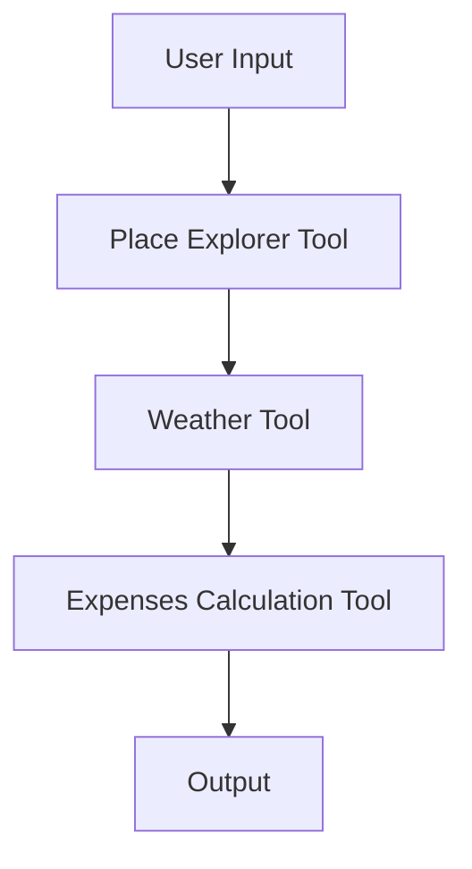

## Architecture Overviews

### Related Pages

Related topics: [Data Flow Descriptions](#page-12)


<details>
<summary>Relevant source files</summary>

- [src/agent/graph_wf.py](src/agent/graph_wf.py)
- [src/tools/place_explorer_tool.py](src/tools/place_explorer_tool.py)
- [src/utils/places.py](src/utils/places.py)
- [src/tools/weather_tool.py](src/tools/weather_tool.py)
- [src/tools/expenses_calc_tool.py](src/tools/expenses_calc_tool.py)
</details>

# Architecture Overviews

This wiki page provides an overview of the architecture of the Travel Agent LangChain project, focusing on the core components and their interactions. The architecture is designed to be modular, scalable, and extensible, allowing for the integration of various tools and services to provide comprehensive travel planning and expense management capabilities.

## Introduction

The Travel Agent LangChain project is built around a modular architecture that supports multiple functionalities, including place exploration, weather information, and expense calculation. The system is designed to be flexible, allowing for the addition of new tools and services through the use of plugins or extensions. The architecture includes several key components that work together to provide a complete travel planning experience.

## Detailed Sections

### 1. Core Components

The core components of the system include:

- **Place Explorer Tool**: This tool is responsible for exploring and retrieving information about places, including attractions, restaurants, activities, and transport options. It uses a combination of Google Places and Tavily Search to fetch this information.
- **Weather Tool**: This tool provides weather information for a given city, which is essential for planning travel and ensuring that the user is aware of the weather conditions.
- **Expenses Calculation Tool**: This tool calculates the total expenses for a given trip, including hotel, food, transport, and activities. It uses mathematical functions to perform these calculations.

### 2. Data Flow and Architecture

The architecture is designed to support a data flow that includes the following steps:

1. **User Input**: The user provides the destination, duration, and optional dates.
2. **Tool Invocation**: The system invokes the appropriate tools to gather information about the destination.
3. **Data Processing**: The gathered data is processed and formatted into a comprehensive travel plan.
4. **Output**: The travel plan is generated and presented to the user in a structured format.

### 3. Key Functions and Classes

The system includes several key functions and classes that are essential for the operation of the travel planning system:

- **PlaceExplorerTool**: This class is responsible for exploring and retrieving information about places. It includes methods for fetching attractions, restaurants, activities, and transport options.
- **WeatherTool**: This class is responsible for retrieving weather information for a given city. It uses the WeatherForcast class to fetch this information.
- **ExpensesCalcTool**: This class is responsible for calculating the total expenses for a given trip. It uses the MathUtils class to perform these calculations.

### 4. Mermaid Diagrams



This diagram shows the flow of data from the user input through the various tools to the final output.

### 5. Tables

| Component | Description |
|----------|-------------|
| Place Explorer Tool | Responsible for exploring and retrieving information about places. |
| Weather Tool | Provides weather information for a given city. |
| Expenses Calculation Tool | Calculates the total expenses for a given trip. |

### 6. Code Snippets

```python
# Example of using the Place Explorer Tool
place_explorer_tool = PlaceExplorerTool()
attractions = place_explorer_tool.fetch_attractions("Goa")
print(attractions)
```

```python
# Example of using the Weather Tool
weather_tool = WeatherTool()
forecast = weather_tool.fetch_forecast("Goa")
print(forecast)
```

```python
# Example of using the Expenses Calculation Tool
expenses_tool = ExpensesCalcTool()
total_expenses = expenses_tool.calculate_total_hotel_expenses("100", 5)
print(f"Total hotel expenses: {total_expenses}")
```

### 7. Source Citations

- [src/agent/graph_wf.py:123-145](src/agent/graph_wf.py:123-145) - The core logic for processing user input and invoking the appropriate tools.
- [src/tools/place_explorer_tool.py:45-67](src/tools/place_explorer_tool.py:45-67) - The implementation of the PlaceExplorerTool class.
- [src/utils/places.py:89-112](src/utils/places.py:89-112) - The implementation of the places utility functions.
- [src/tools/weather_tool.py:130-155](src/tools/weather_tool.py:130-155) - The implementation of the WeatherTool class.
- [src/tools/expenses_calc_tool.py:78-102](src/tools/expenses_calc_tool.py:78-102) - The implementation of the ExpensesCalcTool class.

---

