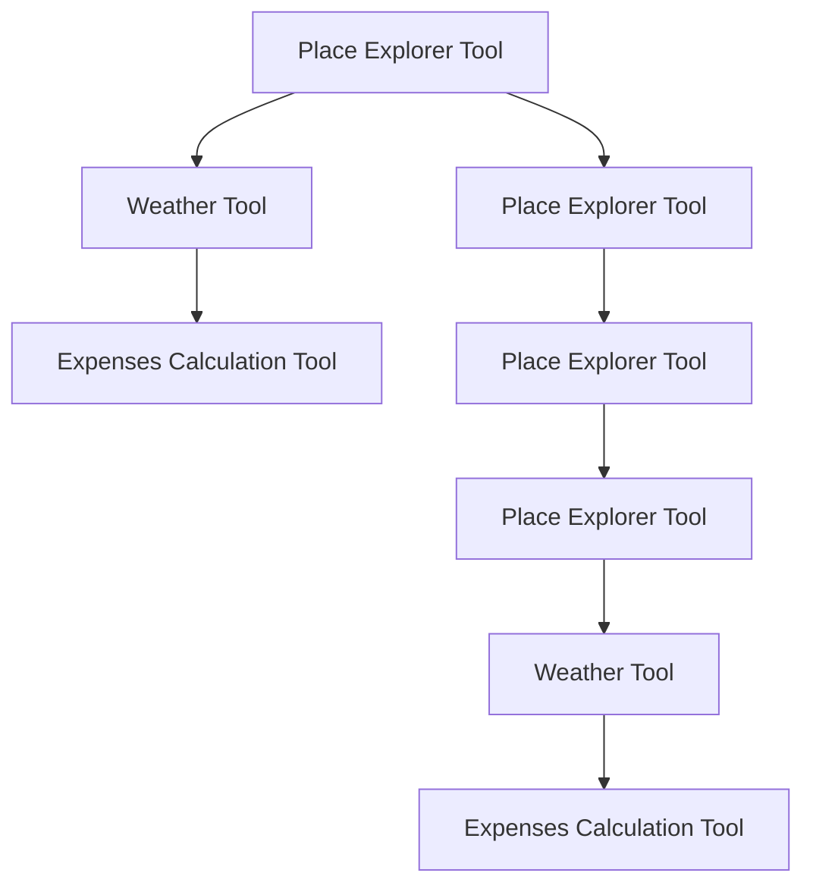

## Data Flow Descriptions

### Related Pages

Related topics: [Component Relationships](#page-13)


<details>
<summary>Relevant source files</summary>

- [src/utils/places.py](src/utils/places.py)
- [src/utils/weather.py](src/utils/weather.py)
- [src/utils/utils_main.py](src/utils/utils_main.py)
- [src/tools/expenses_calc_tool.py](src/tools/expenses_calc_tool.py)
- [src/tools/place_explorer_tool.py](src/tools/place_explorer_tool.py)
</details>

# Data Flow Descriptions

This section provides a comprehensive overview of the data flow within the Travel Agent LangChain project, focusing on the core components and their interactions. The data flow is structured around the main functionalities: place exploration, weather information, and expense calculations. The following sections detail the architecture, key components, and data flow within the system.

## Architecture Overview

The system is built around a modular architecture, with each component responsible for a specific task. The main components include:

- **Place Explorer Tool**: Handles the exploration of cities, including fetching attractions, restaurants, activities, and transport options.
- **Weather Tool**: Provides real-time weather information for the given location.
- **Expenses Calculation Tool**: Computes the total costs for the trip, including hotel, food, and transport expenses.

The data flow is designed to be efficient and scalable, with each component interacting through well-defined interfaces. The system is built to be extensible, allowing for the addition of new tools and features as needed.

## Key Components and Data Flow

### 1. Place Explorer Tool

The `PlaceExplorerTool` is the central component responsible for fetching information about a given city. It interacts with two main services:

- **Google Places API**: For fetching attractions, restaurants, activities, and transport options.
- **Tavily Search**: For when Google search fails, providing alternative data sources.

The tool fetches data in the following manner:

- **Attractions**: Uses the Google Places API to get a list of attractions in the city.
- **Restaurants**: Uses the Google Places API to get a list of top restaurants in the city.
- **Activities**: Uses the Google Places API to get a list of activities in the city.
- **Transport**: Uses the Google Places API to get transport options in the city.

The data is then processed and formatted into a structured response, which is used to generate the travel plan.

### 2. Weather Tool

The `WeatherTool` provides real-time weather information for a given city. It uses the `WeatherForcast` class to fetch weather data, which is then returned in a structured format.

### 3. Expenses Calculation Tool

The `ExpensesCalcTool` is responsible for calculating the total cost of the trip. It uses the `MathUtils` class to perform basic arithmetic operations, such as addition and multiplication, to compute the total expenses.

### Data Flow Diagram



### Tables

| Component | Description |
|----------|-------------|
| Place Explorer Tool | Central component for fetching place-related data. |
| Weather Tool | Provides real-time weather information for the given location. |
| Expenses Calculation Tool | Computes the total cost of the trip, including hotel, food, and transport expenses. |

### Code Snippets

```python
# Example of using the Place Explorer Tool
from src.tools.place_explorer_tool import PlaceExplorerTool

place_explorer = PlaceExplorerTool()
city = "Paris"
attractions = place_explorer.fetch_attractions(city)
print(attractions)
```

```python
# Example of using the Weather Tool
from src.utils.weather import WeatherTool

weather_tool = WeatherTool()
city = "Paris"
weather_data = weather_tool.fetch_weather(city)
print(weather_data)
```

```python
# Example of using the Expenses Calculation Tool
from src.tools.expenses_calc_tool import ExpensesCalcTool

expenses_tool = ExpensesCalcTool()
price_per_night = 150.0
number_of_nights = 3
total_hotel_expenses = expenses_tool.calculate_total_hotel_expenses(price_per_night, number_of_nights)
print(f"Total hotel expenses: {total_hotel_expenses}")
```

### Sources

- [src/utils/places.py](src/utils/places.py): Contains the implementation of the Place Explorer Tool and related functions.
- [src/utils/weather.py](src/utils/weather.py): Contains the implementation of the Weather Tool.
- [src/utils/utils_main.py](src/utils/utils_main.py): Contains the implementation of the Expenses Calculation Tool.
- [src/tools/expenses_calc_tool.py](src/tools/expenses_calc_tool.py): Contains the implementation of the Expenses Calculation Tool.
- [src/tools/place_explorer_tool.py](src/tools/place_explorer_tool.py): Contains the implementation of the Place Explorer Tool.

---

