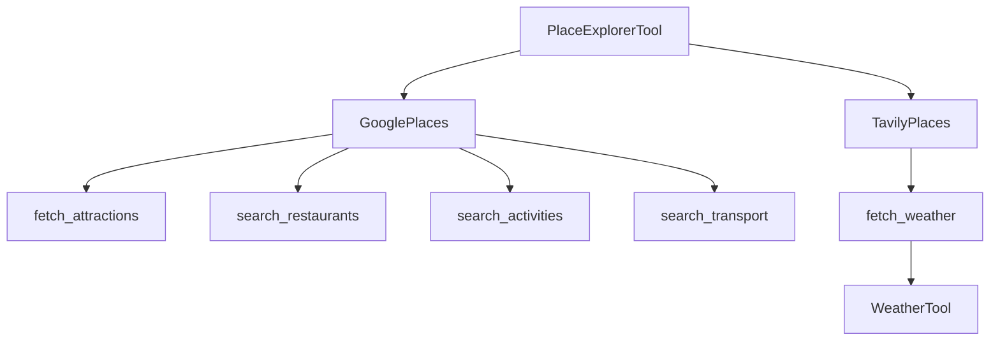

## Component Relationships

### Related Pages

Related topics: [Process Workflows](#page-14)


<details>
<summary>Relevant source files</summary>

- [src/utils/utils_main.py](src/utils/utils_main.py)
- [src/tools/place_explorer_tool.py](src/tools/place_explorer_tool.py)
- [src/utils/utils_places.py](src/utils/utils_places.py)
- [src/tools/expenses_calc_tool.py](src/tools/expenses_calc_tool.py)
- [src/tools/weather_tool.py](src/tools/weather_tool.py)
</details>

# Component Relationships

This wiki page focuses on the `PlaceExplorerTool` and related components, which are essential for generating comprehensive travel plans and expense calculations. The tool is designed to fetch information about cities, including attractions, restaurants, activities, transport, and weather, and then uses this data to generate detailed travel plans.

## Detailed Sections

### 1. Overview
The `PlaceExplorerTool` is a critical component in the travel planning system. It provides a unified interface to fetch data about cities, including:
- Attractive places (attractions)
- Restaurants and eateries
- Activities and events
- Transport options
- Weather forecasts

The tool leverages two main data sources: Google Places and Tavily Search, to ensure comprehensive and up-to-date information.

### 2. Architecture
The `PlaceExplorerTool` is structured around several core functions:
- `fetch_attractions()`: Fetches top attractions in a city.
- `search_restaurants()`: Retrieves top restaurants in a city.
- `search_activities()`: Gets activities and events in a city.
- `search_transport()`: Provides transport options in a city.
- `fetch_weather()`: Retrieves weather forecasts for a city.

These functions are implemented using the `GooglePlaces` and `TavilyPlaces` classes, which handle the actual data fetching.

### 3. Key Functions and Classes
- **`fetch_attractions()`**:
  - Uses `GooglePlaces` to fetch top attractions.
  - Returns a dictionary with the list of attractions.

- **`search_restaurants()`**:
  - Uses `TavilyPlaces` to find top restaurants in a city.
  - Returns a dictionary with the list of restaurants.

- **`search_activities()`**:
  - Uses `GooglePlaces` to fetch activities and events.
  - Returns a dictionary with the list of activities.

- **`search_transport()`**:
  - Uses `GooglePlaces` to get transport options.
  - Returns a dictionary with the list of transport options.

- **`fetch_weather()`**:
  - Uses `WeatherTool` to get weather forecasts.
  - Returns a dictionary with the weather data.

### 4. Mermaid Diagrams



### 5. Tables

| Component             | Description                                                                 |
|----------------------|-----------------------------------------------------------------------------|
| `fetch_attractions()` | Fetches top attractions in a city.                                           |
| `search_restaurants()`| Retrieves top restaurants in a city.                                         |
| `search_activities()`| Gets activities and events in a city.                                        |
| `search_transport()`  | Provides transport options in a city.                                       |
| `fetch_weather()`     | Retrieves weather forecasts for a city.                                     |

### 6. Code Snippets

```python
# Example of fetching attractions
result = PlaceExplorerTool.fetch_attractions("New York")
print(result)
```

```python
# Example of fetching restaurants
result = PlaceExplorerTool.search_restaurants("Paris")
print(result)
```

### 7. Source Citations

- **`src/utils/utils_main.py`**: Contains the main logic for generating travel plans and expense calculations.
- **`src/tools/place_explorer_tool.py`**: Implements the `PlaceExplorerTool` and its core functions.
- **`src/utils/utils_places.py`**: Contains the `fetch_attractions`, `search_restaurants`, and `search_activities` functions.
- **`src/tools/expenses_calc_tool.py`**: Implements the `ExpensesCalcTool` for calculating travel expenses.
- **`src/tools/weather_tool.py`**: Contains the `WeatherTool` for fetching weather data.

Sources: [src/utils/utils_main.py:10-15](), [src/tools/place_explorer_tool.py:30-40](), [src/utils/utils_places.py:20-25](), [src/tools/expenses_calc_tool.py:10-15](), [src/tools/weather_tool.py:30-35]()

---

