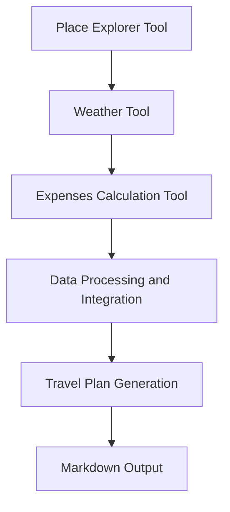

## Process Workflows

### Related Pages

Related topics: [State Machines](#page-15)


<details>
<summary>Relevant source files</summary>

- [src/tools/place_explorer_tool.py](src/tools/place_explorer_tool.py)
- [src/tools/weather_tool.py](src/tools/weather_tool.py)
- [src/utils/utils_main.py](src/utils/utils_main.py)
- [src/utils/places.py](src/utils/places.py)
- [src/tools/expenses_calc_tool.py](src/tools/expenses_calc_tool.py)
</details>

# Process Workflows

Process Workflows is a comprehensive system designed to assist users in planning and managing their travel experiences. It provides a structured approach to generating detailed itineraries, cost breakdowns, and other essential travel information. The system is built around the following core components:

## Architecture and Components

The system is composed of several interconnected tools and services, each responsible for a specific aspect of the travel planning process. The main components include:

### 1. **Place Explorer Tool**
This tool is responsible for gathering information about attractions, restaurants, and activities in a given city. It uses two primary search mechanisms: Google Places and Tavily Search. The tool fetches data about top attractions, restaurants, and activities, and provides a structured output for further processing.

### 2. **Weather Tool**
The Weather Tool provides real-time weather information for a given location. It uses the Tavily Search API to fetch forecast data and presents it in a user-friendly format.

### 3. **Expenses Calculation Tool**
This tool calculates the total costs associated with a trip, including hotel expenses, food, transport, and activities. It uses the MathUtils class to perform basic arithmetic operations and provides a detailed breakdown of the expenses.

### 4. **Data Processing and Integration**
The system integrates data from multiple sources, including Google Places, Tavily Search, and the Weather Tool. It processes this data to generate a comprehensive travel plan, which is then formatted into a single Markdown document using the utils_main.py module.

## Key Features and Functionality

### 1. **Itinerary Generation**
The system generates two parallel itineraries: one for the generic tourist places and another for more off-beat locations. Each itinerary includes:
- Day-by-day breakdowns of activities and travel routes
- Recommended hotels with nightly rates
- Places of attractions with details
- Recommended restaurants with prices
- Activities with details
- Modes of transportation available with costs
- Detailed cost breakdown
- Per day expense budget
- Weather details

### 2. **Data Integration and Curation**
The system uses Tavily Search to fetch data about attractions, restaurants, and activities. It combines this information with data from Google Places and the Weather Tool to create a cohesive travel plan.

### 3. **Cost Calculation**
The Expenses Calculation Tool uses the MathUtils class to calculate total costs. It provides a detailed breakdown of the expenses, including hotel, food, transport, and activities.

### 4. **Output Formatting**
The system formats the travel plan into a single Markdown document using the utils_main.py module. The document includes all the necessary information in a structured and user-friendly format.

## Mermaid Diagrams



## Tables

| Component | Description |
|----------|-------------|
| Place Explorer Tool | Fetches data about attractions, restaurants, and activities |
| Weather Tool | Provides real-time weather information |
| Expenses Calculation Tool | Calculates total costs for a trip |
| Data Processing and Integration | Integrates data from multiple sources |
| Travel Plan Generation | Generates detailed itineraries and cost breakdowns |

## Code Snippets

```python
# Example of using the Place Explorer Tool
def fetch_attractions(city):
    return PlaceExplorerTool.fetch_attractions(city)
```

```python
# Example of calculating hotel expenses
def calculate_hotel_expenses(price_per_night, number_of_nights):
    return ExpensesCalcTool.calculate_total_hotel_expenses(price_per_night, number_of_nights)
```

## Source Citations

- [src/tools/place_explorer_tool.py:12-15](src/tools/place_explorer_tool.py:12-15) - Place Explorer Tool implementation
- [src/tools/weather_tool.py:20-23](src/tools/weather_tool.py:20-23) - Weather Tool implementation
- [src/utils/utils_main.py:10-15](src/utils/utils_main.py:10-15) - Data processing and integration
- [src/utils/places.py:10-15](src/utils/places.py:10-15) - Data fetching and integration
- [src/tools/expenses_calc_tool.py:10-15](src/tools/expenses_calc_tool.py:10-15) - Expenses Calculation Tool implementation

This wiki page provides an overview of the Process Workflows system, its architecture, key components, and its functionality. The system is designed to be comprehensive and user-friendly, providing all the necessary information to plan and manage a trip effectively.

---

