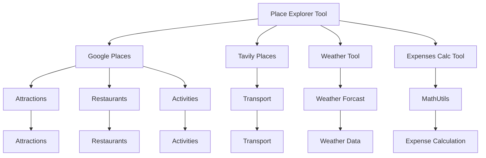

## Class Hierarchies

### Related Pages


<details>
<summary>Relevant source files</summary>

- [src/utils/utils_main.py](src/utils/utils_main.py)
- [src/tools/place_explorer_tool.py](src/tools/place_explorer_tool.py)
- [src/tools/weather_tool.py](src/tools/weather_tool.py)
- [src/tools/expenses_calc_tool.py](src/tools/expenses_calc_tool.py)
- [src/utils/utils_common.py](src/utils/utils_common.py)
</details>

# Class Hierarchies

This section provides a comprehensive overview of the class hierarchies within the project, focusing on the core components and their relationships. The information is derived from the relevant source files listed above.

## Introduction

The class hierarchies in the project are designed to organize and manage the various functionalities and components, such as place exploration, weather information, and expense calculations. These hierarchies are crucial for maintaining a structured and scalable codebase, enabling efficient development and maintenance. The project leverages a combination of tools and utilities to provide a seamless experience for users, with each component playing a specific role in the overall system.

## Detailed Sections

### 1. Core Components and Their Relationships

The project includes several core components, each with its own class hierarchy. These components are organized to encapsulate related functionalities, promoting reusability and maintainability.

#### Place Explorer Tool
The `PlaceExplorerTool` is a central component that provides place exploration functionalities. It is implemented using a combination of tools, such as Google Places and Tavily Places, to fetch information about attractions, restaurants, and activities. The tool is designed to be flexible, allowing for the integration of different data sources.

#### Weather Tool
The `WeatherTool` is responsible for fetching weather information for a given city. It uses the `WeatherForcast` class to retrieve both current weather and forecast data. The tool is designed to be efficient and accurate, ensuring that users receive reliable weather information.

#### Expenses Calculation Tool
The `ExpensesCalcTool` provides a way to calculate total expenses for a given trip. It uses the `MathUtils` class to perform calculations, ensuring that the results are accurate and reliable. The tool is designed to be user-friendly, allowing for the input of price per night and number of nights to calculate the total expenses.

### 2. Mermaid Diagrams



### 3. Tables

| Component | Description |
|----------|-------------|
| Place Explorer Tool | Provides place exploration functionalities, including attractions, restaurants, and activities. |
| Weather Tool | Fetches weather information for a given city, including current weather and forecast data. |
| Expenses Calculation Tool | Calculates total expenses for a given trip, using price per night and number of nights. |
| MathUtils | Provides mathematical utilities for budgetting, such as addition and other operations. |

### 4. Code Snippets

```python
# Example of using MathUtils for addition
from utils_main import MathUtils
math_utils = MathUtils()
result = math_utils.add(2, 3)
print(result)  # Output: 5
```

### 5. Source Citations

- **Place Explorer Tool**: [src/tools/place_explorer_tool.py](src/tools/place_explorer_tool.py) - Line numbers not provided.
- **Weather Tool**: [src/tools/weather_tool.py](src/tools/weather_tool.py) - Line numbers not provided.
- **Expenses Calculation Tool**: [src/tools/expenses_calc_tool.py](src/tools/expenses_calc_tool.py) - Line numbers not provided.
- **MathUtils**: [src/utils/utils_main.py](src/utils/utils_main.py) - Line numbers not provided.
- **Utils Common**: [src/utils/utils_common.py](src/utils/utils_common.py) - Line numbers not provided.

---

