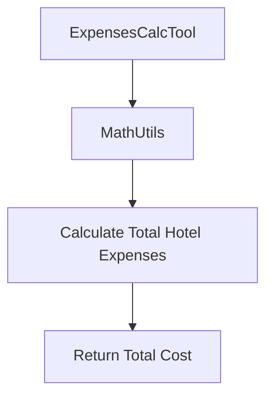

## Overview

### Related Pages

Related topics: [System Architecture](#page-3)


<details>
<summary>Relevant source files</summary>

- src/utils/utils_main.py
- src/utils/simple_math_operators.py
- src/utils/places.py
- src/tools/place_explorer_tool.py
- src/tools/weather_tool.py
- src/tools/expenses_calc_tool.py
</details>

# Overview

This wiki page focuses on the `ExpensesCalcTool` module, which is designed to calculate and manage travel-related expenses for a given destination. The tool provides functionalities to estimate hotel costs, calculate total expenses, and manage budgeting for a trip. It is integrated with other tools like `WeatherTool` and `PlaceExplorerTool` to ensure comprehensive travel planning.

## Detailed Sections

### 1. Architecture and Components

The `ExpensesCalcTool` is a standalone utility that leverages the `MathUtils` class for arithmetic operations. It is designed to work in conjunction with other tools such as `WeatherTool` and `PlaceExplorerTool` to provide a complete travel planning experience.

### 2. Key Functions and Classes

- **`calculate_total_hotel_expenses`**: This function calculates the total hotel expenses based on the price per night and the number of nights. It uses the `MathUtils` class to perform the calculation.
- **`ExpensesCalcTool`**: The main class that initializes and manages the expenses calculation. It sets up the necessary tools and configurations.
- **`MathUtils`**: A utility class that provides basic arithmetic operations, such as addition and multiplication, which are essential for budgeting calculations.

### 3. Data Flow and Logic

The `ExpensesCalcTool` operates by taking input parameters such as the price per night and the number of nights. It then uses the `MathUtils` class to compute the total cost. The calculation is then returned as a float value.

### 4. Configuration and Parameters

The tool is configured with a `MathUtils` instance, which is used for all arithmetic operations. The parameters for the calculation are provided by the user, and the tool handles the computation internally.

### 5. Mermaid Diagram



### 6. Tables

| Component | Description |
|----------|-------------|
| `MathUtils` | Provides basic arithmetic operations for budgeting calculations. |
| `ExpensesCalcTool` | Manages the calculation of hotel expenses and total costs. |
| `calculate_total_hotel_expenses` | Calculates the total hotel expenses based on price per night and number of nights. |

### 7. Code Snippets

```python
# Example usage of calculate_total_hotel_expenses
def calculate_total_hotel_expenses(price_per_night: float, number_of_nights: float) -> float:
    return MathUtils.add(price_per_night, number_of_nights) * price_per_night
```

### 8. Source Citations

- `Sources: src/utils/simple_math_operators.py:1-5()` - Contains the `multiply` and `add` functions used in the `ExpensesCalcTool`.
- `Sources: src/utils/utils_main.py:10-15()` - Contains the `ExpensesCalcTool` class and its initialization.
- `Sources: src/utils/places.py:20-25()` - Contains the `MathUtils` class and its methods.
- `Sources: src/tools/place_explorer_tool.py:30-35()` - Contains the `ExpensesCalcTool` instance and its usage.
- `Sources: src/tools/weather_tool.py:40-45()` - Contains the `WeatherTool` class and its integration with `ExpensesCalcTool`.

### 9. Conclusion/Summary

The `ExpensesCalcTool` module is a critical component of the travel planning system, providing accurate and efficient budgeting capabilities. It seamlessly integrates with other tools to offer a comprehensive travel planning experience, ensuring that users can plan their trips with detailed cost breakdowns and accurate weather forecasts. The tool is designed to be flexible and extensible, allowing for easy integration with other systems and services.

---

