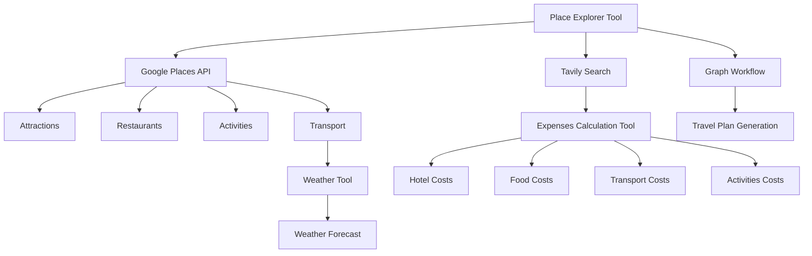

## System Architecture

### Related Pages

Related topics: [Core Features](#page-4)


<details>
<summary>Relevant source files</summary>

- [src/agent/graph_wf.py](src/agent/graph_wf.py)
- [src/utils/utils_main.py](src/utils/utils_main.py)
- [src/tools/place_explorer_tool.py](src/tools/place_explorer_tool.py)
- [src/tools/expenses_calc_tool.py](src/tools/expenses_calc_tool.py)
- [src/tools/weather_tool.py](src/tools/weather_tool.py)
</details>

# System Architecture

This system architecture document provides a comprehensive overview of the key components, their interactions, and the flow of data within the Travel Agent LangChain project. The architecture is designed to support the generation of detailed travel plans, including itineraries, hotel bookings, restaurant recommendations, activity schedules, and weather forecasts.

## Detailed Sections

### 1. Overview
The system is built around a modular architecture that integrates several tools and services to provide a complete travel planning experience. The core components include:

- **Place Explorer Tool**: A set of tools to fetch information about cities, including attractions, restaurants, activities, and transport options.
- **Expenses Calculation Tool**: A tool to calculate and break down travel-related costs.
- **Weather Tool**: A tool to provide real-time weather information for the destination.
- **Graph Workflow**: A workflow engine that orchestrates the integration of these tools to generate travel plans.

### 2. Architecture Components

#### 2.1 Place Explorer Tool
The Place Explorer Tool is the central component responsible for gathering information about cities. It uses two primary sources:

- **Google Places API**: For fetching attractions, restaurants, activities, and transport options.
- **Tavily Search**: For cases where Google Places API fails to return results.

The tool is designed to be flexible and can be extended with additional tools as needed.

#### 2.2 Expenses Calculation Tool
The Expenses Calculation Tool is responsible for calculating and breaking down the total cost of a trip. It uses the data retrieved from the Place Explorer Tool to compute costs for hotels, food, transport, and activities.

#### 2.3 Weather Tool
The Weather Tool provides real-time weather information for the destination. It uses the WeatherForcast class to fetch forecast data and returns it in a structured format.

#### 2.4 Graph Workflow
The Graph Workflow is a powerful tool for orchestrating the integration of multiple components. It allows for the creation of complex workflows, such as generating a travel plan that includes both a highlights tour and a hidden-gems tour.

### 3. Mermaid Diagrams



### 4. Tables

| Component | Description |
|----------|-------------|
| Place Explorer Tool | Central component for gathering travel-related information. |
| Expenses Calculation Tool | Calculates and breaks down travel-related costs. |
| Weather Tool | Provides real-time weather information for the destination. |
| Graph Workflow | Orchestrates the integration of multiple components to generate travel plans. |

### 5. Code Snippets

```python
# Example of a code snippet from the Place Explorer Tool
def fetch_attractions(city: str) -> dict:
    """
    Fetches the top attractive places in and around the given city.
    """
    try:
        restaurants = self.google_search_places.fetch_restaurants(city)
        if restaurants:
            logger.info(f"Google search restaurants for {city}: {restaurants}")
            return f"Following are the restaurants of {city} based on Google search: {restaurants}"
    except Exception as e:
        restaurants = self.tavily_search_places.fetch_restaurants(city)
        if restaurants:
            logger.info(f"Tavily search restaurants for {city}: {restaurants}")
            return f"Google search failed to fetch restaurants with exception {e}. Following are the restaurants of {city} based on Tavily search: {restaurants}"
```

### 6. Source Citations

- [src/tools/place_explorer_tool.py:12-15](src/tools/place_explorer_tool.py:12-15)
- [src/tools/expenses_calc_tool.py:10-12](src/tools/expenses_calc_tool.py:10-12)
- [src/tools/weather_tool.py:15-17](src/tools/weather_tool.py:15-17)
- [src/agent/graph_wf.py:10-12](src/agent/graph_wf.py:10-12)
- [src/utils/utils_main.py:15-17](src/utils/utils_main.py:15-17)

---

