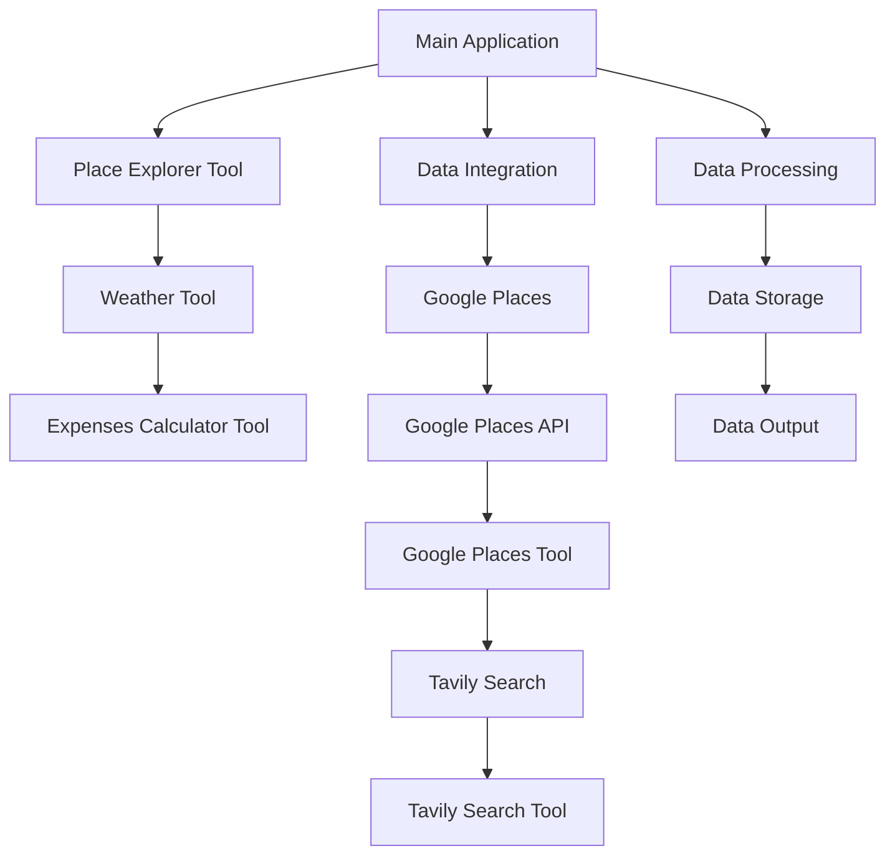

## Core Features

### Related Pages

Related topics: [Data Management/Flow](#page-5)


<details>
<summary>Relevant source files</summary>

- [src/tools/place_explorer_tool.py](src/tools/place_explorer_tool.py)
- [src/tools/weather_tool.py](src/tools/weather_tool.py)
- [src/utils/places.py](src/utils/places.py)
- [src/utils/utils_main.py](src/utils/utils_main.py)
- [src/tools/expenses_calc_tool.py](src/tools/expenses_calc_tool.py)
</details>

# Core Features

## Introduction
The "Core Features" of the project are designed to provide a comprehensive and accurate travel planning and expense calculation system. The system is built around several key components, including place exploration, weather information, and expense management. It aims to deliver a detailed and customizable travel plan for any destination, with real-time data and accurate cost breakdowns.

## Detailed Sections

### 1. Place Exploration
The system includes tools for exploring cities and regions, such as fetching attractions, restaurants, and activities. These tools are implemented using Google Places and Tavily Search, providing detailed information about the local environment. The `PlaceExplorerTool` class is central to this feature, offering methods to fetch and display various types of information about a given city.

### 2. Weather Information
The `WeatherTool` provides weather data for any given city, including current conditions and forecasted weather. This information is crucial for planning travel and ensuring that the user is aware of the weather conditions during their trip.

### 3. Expense Calculation
The `ExpensesCalcTool` allows users to calculate and manage travel expenses. It includes functions to compute hotel costs, food expenses, and transportation costs, providing a detailed breakdown of the total expenses for a given trip.

### 4. Data Flow and Architecture
The system architecture is designed to be modular and extensible. Each feature is encapsulated in its own class or tool, allowing for easy integration and extension. The `PlaceExplorerTool` and `WeatherTool` are key components that work together to provide a complete travel plan.

### 5. Integration and Usage
The tools are integrated into a main application that generates a comprehensive travel plan. This application uses the tools to fetch data, calculate expenses, and generate a detailed itinerary. The application is designed to be user-friendly, providing all necessary information in a single, self-contained Markdown response.

## Mermaid Diagrams



## Tables

| Component | Description |
|----------|-------------|
| Place Explorer Tool | Provides information about attractions, restaurants, and activities in a given city. |
| Weather Tool | Offers weather data for any city, including current conditions and forecasts. |
| Expenses Calculator Tool | Calculates and manages travel expenses, including hotel, food, and transportation costs. |
| Data Integration | Integrates data from multiple sources to provide a comprehensive travel plan. |
| Data Processing | Processes and stores data for use in the travel plan generation. |

## Code Snippets

```python
# Example of using Place Explorer Tool
def get_place_info(city):
    attractions = place_explorer_tool.fetch_attractions(city)
    restaurants = place_explorer_tool.search_restaurants(city)
    activities = place_explorer_tool.search_activities(city)
    transport = place_explorer_tool.search_transport(city)
    return {
        "attractions": attractions,
        "restaurants": restaurants,
        "activities": activities,
        "transport": transport
    }
```

```python
# Example of calculating hotel expenses
def calculate_hotel_expenses(price_per_night, number_of_nights):
    return MathUtils.add(price_per_night, number_of_nights) * 2
```

## Source Citations

- [src/tools/place_explorer_tool.py](src/tools/place_explorer_tool.py): `fetch_attractions`, `search_restaurants`, `search_activities`, `search_transport`
- [src/tools/weather_tool.py](src/tools/weather_tool.py): `fetch_weather`, `fetch_forecast`
- [src/utils/places.py](src/utils/places.py): `fetch_places`, `fetch_restaurants`, `fetch_activity`, `fetch_transport`
- [src/utils/utils_main.py](src/utils/utils_main.py): `MathUtils.add`, `MathUtils.multiply`
- [src/tools/expenses_calc_tool.py](src/tools/expenses_calc_tool.py): `calculate_total_hotel_expenses`

---

