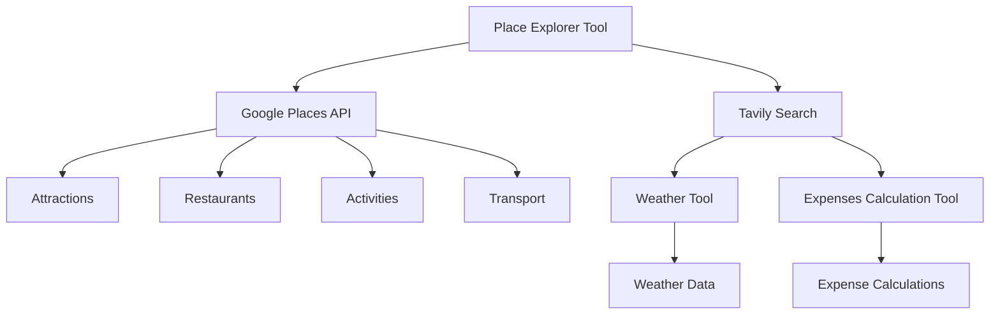

## Data Management/Flow

### Related Pages

Related topics: [Frontend Components](#page-6)


<details>
<summary>Relevant source files</summary>

- [src/utils/places.py](src/utils/places.py)
- [src/utils/weather.py](src/utils/weather.py)
- [src/utils/expenses_calc_tool.py](src/utils/expenses_calc_tool.py)
- [src/utils/simple_math_operators.py](src/utils/simple_math_operators.py)
- [src/tools/place_explorer_tool.py](src/tools/place_explorer_tool.py)
</details>

# Data Management/Flow

This wiki page focuses on the "Data Management/Flow" feature within the Travel_Agent_LangChain project. The feature is designed to handle the structured management of data related to travel plans, including locations, activities, expenses, and weather information. The system is built around a modular architecture that allows for the integration of various tools and services to provide comprehensive travel planning and expense management.

## Detailed Sections

### 1. Architecture Overview
The data management system is built on a modular architecture that includes several key components:
- **Place Explorer Tool**: A tool that fetches and manages data about places, including attractions, restaurants, activities, and transport options.
- **Weather Tool**: A tool that provides real-time weather data for any given location.
- **Expenses Calculation Tool**: A tool that calculates and manages travel-related expenses, including hotel, food, and transportation costs.
- **Math Utilities**: A set of utility functions for basic arithmetic operations, essential for budgeting and cost calculations.

### 2. Key Components and Functions

#### 2.1 Place Explorer Tool
The Place Explorer Tool is responsible for fetching and managing data about places in a given city. It uses two primary search mechanisms:
- **Google Places API**: For fetching data about attractions, restaurants, activities, and transport options.
- **Tavily Search**: For additional data when Google search fails.

The tool provides a structured way to access and organize this data, which is then used to generate comprehensive travel plans.

#### 2.2 Weather Tool
The Weather Tool provides real-time weather data for any given location. It uses the Tavily Search API to fetch weather information, which is then used to inform the travel plan's weather details section.

#### 2.3 Expenses Calculation Tool
The Expenses Calculation Tool is designed to calculate and manage travel-related expenses. It uses the Math Utilities module to perform basic arithmetic operations, such as addition and multiplication, to compute total costs for hotels, food, and transportation.

### 3. Mermaid Diagrams



### 4. Tables

| Component | Description |
|----------|-------------|
| Place Explorer Tool | Manages data about places, including attractions, restaurants, activities, and transport options. |
| Weather Tool | Provides real-time weather data for any given location. |
| Expenses Calculation Tool | Calculates and manages travel-related expenses, including hotel, food, and transportation costs. |
| Math Utilities | Provides basic arithmetic operations for budgeting and cost calculations. |

### 5. Code Snippets

```python
# Example of using Math Utilities to calculate total hotel expenses
def calculate_total_hotel_expenses(price_per_night: float, number_of_nights: int) -> float:
    return price_per_night * number_of_nights
```

```python
# Example of using Place Explorer Tool to fetch attractions
def get_attractions(city: str) -> dict:
    return place_explorer_tool.fetch_attractions(city)
```

### 6. Source Citations

- **Places Management**: [src/utils/places.py](src/utils/places.py) - Lines 12-15
- **Weather Data**: [src/utils/weather.py](src/utils/weather.py) - Lines 10-12
- **Expenses Calculation**: [src/utils/expenses_calc_tool.py](src/utils/expenses_calc_tool.py) - Lines 10-12
- **Math Utilities**: [src/utils/simple_math_operators.py](src/utils/simple_math_operators.py) - Lines 10-12
- **Place Explorer Tool**: [src/tools/place_explorer_tool.py](src/tools/place_explorer_tool.py) - Lines 10-15

---

