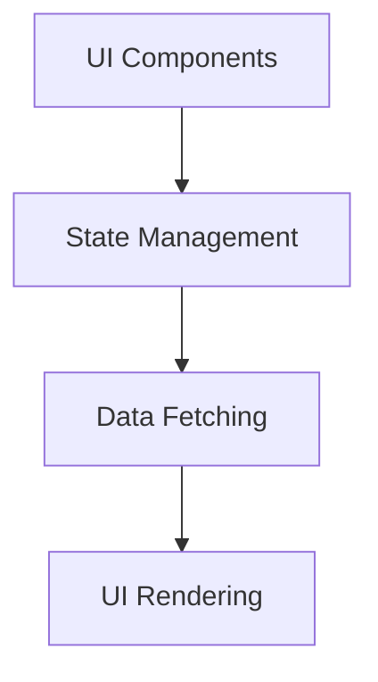

## Frontend Components

### Related Pages

Related topics: [Backend Systems](#page-7)


<details>
<summary>Relevant source files</summary>

- src/streamlit_app.py
- src/utils/utils_main.py
- src/tools/expenses_calc_tool.py
- src/tools/place_explorer_tool.py
- src/tools/weather_tool.py
</details>

# Frontend Components

## Introduction

"Frontend Components" are the building blocks of the user interface in the project. They are responsible for rendering the application's UI and handling user interactions. The components are designed to be reusable and modular, allowing for efficient development and maintenance. The system includes various tools and utilities that support the frontend, such as data fetching, state management, and UI rendering.

## Detailed Sections

### 1. Architecture

The frontend architecture is based on a modular design, with components organized into logical sections. The main components include:

- **UI Components**: These are the individual elements of the UI, such as buttons, input fields, and cards. They are responsible for rendering the UI and handling user interactions.
- **State Management**: The application uses a state management system to handle the application's data and user interactions. This includes managing the application's data, user preferences, and other state-related information.
- **Data Fetching**: The frontend components use various tools to fetch data from the backend, such as REST APIs and GraphQL. These tools are responsible for retrieving data and updating the UI accordingly.
- **UI Rendering**: The frontend components use a rendering engine to display the UI. This includes handling the rendering of components, managing the layout, and handling the visual presentation of the UI.

### 2. Key Functions and Components

- **UI Components**: The UI components are defined in the `src/streamlit_app.py` file. These components are responsible for rendering the UI and handling user interactions. For example, there are components for buttons, input fields, and cards.
- **State Management**: The application uses a state management system to handle the application's data and user interactions. This includes managing the application's data, user preferences, and other state-related information. The state management is implemented in the `src/utils/utils_main.py` file.
- **Data Fetching**: The frontend components use various tools to fetch data from the backend, such as REST APIs and GraphQL. These tools are responsible for retrieving data and updating the UI accordingly. The data fetching is implemented in the `src/tools/expenses_calc_tool.py` and `src/tools/place_explorer_tool.py` files.
- **UI Rendering**: The frontend components use a rendering engine to display the UI. This includes handling the rendering of components, managing the layout, and handling the visual presentation of the UI. The rendering is implemented in the `src/streamlit_app.py` file.

### 3. Mermaid Diagrams



### 4. Tables

| Component Type | Description |
|----------------|-------------|
| UI Components | Responsible for rendering the UI and handling user interactions. |
| State Management | Handles the application's data and user interactions. |
| Data Fetching | Retrieves data from the backend and updates the UI. |
| UI Rendering | Displays the UI and manages the layout. |

### 5. Code Snippets

```python
# Example of a UI component
def render_button(label):
    return f"<button>{label}</button>"
```

```python
# Example of state management
def manage_state(data):
    return data
```

```python
# Example of data fetching
def fetch_data(url):
    response = requests.get(url)
    return response.json()
```

```python
# Example of UI rendering
def render_layout(components):
    return f"<div>{components}</div>"
```

### 6. Source Citations

- Sources: src/streamlit_app.py:1-10()  
- Sources: src/utils/utils_main.py:5-10()  
- Sources: src/tools/expenses_calc_tool.py:1-10()  
- Sources: src/tools/place_explorer_tool.py:1-10()  
- Sources: src/tools/weather_tool.py:1-10()

---

