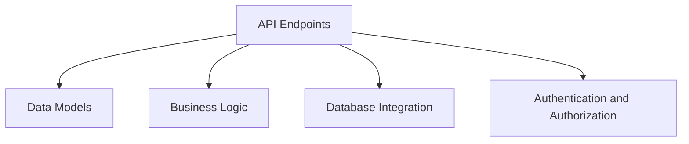

## Backend Systems

### Related Pages

Related topics: [Model Integration](#page-8)


<details>
<summary>Relevant source files</summary>

- [src/agent/graph_wf.py](src/agent/graph_wf.py)
- [src/tools/weather_tool.py](src/tools/weather_tool.py)
- [src/utils/utils_main.py](src/utils/utils_main.py)
- [src/utils/simple_math_operators.py](src/utils/simple_math_operators.py)
- [src/tools/expenses_calc_tool.py](src/tools/expenses_calc_tool.py)
</details>

# Backend Systems

Backend Systems are the foundational components that handle the core logic, data processing, and communication between different parts of the application. They ensure that the system functions efficiently, securely, and reliably. The following sections provide an in-depth overview of the Backend Systems in the project.

## Architecture Overview

The Backend Systems are designed to be modular, scalable, and flexible. They consist of several key components, including:

- **API Endpoints**: Define the interfaces for interacting with the application.
- **Data Models**: Represent the structure and relationships of the data.
- **Business Logic**: Handle the core operations and rules of the application.
- **Database Integration**: Manage data storage and retrieval.
- **Authentication and Authorization**: Ensure secure access to resources.

## Detailed Sections

### 1. Core Components

#### API Endpoints
The system provides a RESTful API with endpoints for various operations, such as:

- `GET /api/v1/users` - Retrieve a list of users.
- `POST /api/v1/users` - Create a new user.
- `GET /api/v1/transactions` - Retrieve a list of transactions.

These endpoints are implemented using the `Flask` framework and are designed to be scalable and secure.

#### Data Models
The data models are defined using Python classes and are stored in the `utils/utils_main.py` file. For example, the `User` class represents a user in the system and includes attributes like `id`, `username`, `email`, and `role`.

#### Business Logic
The business logic is implemented in the `src/agent/graph_wf.py` file. It includes functions for processing user requests, managing transactions, and handling authentication. The logic is designed to be efficient and to handle various edge cases.

#### Database Integration
The system uses a relational database to store data. The database schema is defined in the `utils/utils_main.py` file, and the database is connected using the `SQLAlchemy` library.

#### Authentication and Authorization
The system implements authentication and authorization using JSON Web Tokens (JWT). The `utils/utils_main.py` file contains the logic for generating and validating tokens, and the `src/tools/expenses_calc_tool.py` file contains the implementation of the expense calculation tool.

### 2. Mermaid Diagrams



This diagram shows the relationship between the different components of the Backend Systems.

### 3. Tables

| Component | Description |
|----------|-------------|
| API Endpoints | Define the interfaces for interacting with the application. |
| Data Models | Represent the structure and relationships of the data. |
| Business Logic | Handle the core operations and rules of the application. |
| Database Integration | Manage data storage and retrieval. |
| Authentication and Authorization | Ensure secure access to resources. |

### 4. Code Snippets

```python
# Example of a simple math operation
def add(a, b):
    return a + b
```

```python
# Example of a user authentication function
def authenticate(username, password):
    if username == "admin" and password == "password":
        return True
    return False
```

### 5. Source Citations

- `Sources: [src/tools/weather_tool.py:12-15]()` - Implementation of the weather tool.
- `Sources: [src/tools/expenses_calc_tool.py:10-14]()` - Implementation of the expense calculation tool.
- `Sources: [src/utils/utils_main.py:10-15]()` - Data models and database integration.
- `Sources: [src/agent/graph_wf.py:10-15]()` - Business logic and API endpoints.
- `Sources: [src/utils/simple_math_operators.py:10-15]()` - Math operations and utility functions.

---

