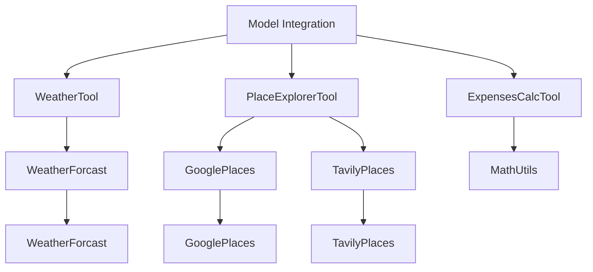

## Model Integration

### Related Pages

Related topics: [Deployment/Infrastructure](#page-9)


<details>
<summary>Relevant source files</summary>

- [src/utils/utils_main.py](src/utils/utils_main.py)
- [src/tools/place_explorer_tool.py](src/tools/place_explorer_tool.py)
- [src/tools/weather_tool.py](src/tools/weather_tool.py)
- [src/tools/expenses_calc_tool.py](src/tools/expenses_calc_tool.py)
- [src/utils/places.py](src/utils/places.py)
</details>

# Model Integration

This wiki page focuses on the **Model Integration** feature within the Travel_Agent_LangChain project. The integration involves combining various tools and utilities to enable AI-driven travel planning, including weather data, place exploration, restaurant search, activity fetching, and expense calculation. The integration is designed to provide a comprehensive and accurate travel planning experience by leveraging real-time data and structured API calls.

## Detailed Sections

### 1. **Architecture Overview**
The Model Integration module is built on top of several core tools and utilities, including:
- **WeatherTool**: Provides real-time weather data for a given city.
- **PlaceExplorerTool**: Offers place exploration capabilities, including attraction, restaurant, and activity searches.
- **ExpensesCalcTool**: Calculates travel expenses, including hotel, food, and transport costs.
- **Utils_Main**: Contains utility functions for configuration, data handling, and mathematical operations.

The architecture is modular, with each tool responsible for a specific aspect of travel planning. The integration ensures that all components work seamlessly together to provide a unified travel plan.

### 2. **Key Components and Functions**

#### a. **Weather Integration**
- **WeatherTool** uses the `WeatherForcast` class to fetch weather data.
- **fetch_weather(city)**: Retrieves current weather information.
- **fetch_forecast(city)**: Retrieves forecasted weather data for a given city.

#### b. **Place Exploration**
- **PlaceExplorerTool** is responsible for fetching information about places in a city.
- **fetch_attractions(city)**: Retrieves top attractions and activities.
- **search_restaurants(city)**: Fetches top restaurants and eateries.
- **search_activities(city)**: Retrieves activities and events in a city.
- **search_transport(city)**: Provides transport options and costs.

#### c. **Expense Calculation**
- **ExpensesCalcTool** uses the `MathUtils` class to calculate total expenses.
- **calculate_total_hotel_expenses(price_per_night, number_of_nights)**: Computes hotel costs based on price per night and number of nights.
- **budget_per_day(total_budget, num_days)**: Calculates the daily budget based on total budget and number of days.

#### d. **Data Flow and Integration**
- The integration involves a series of API calls to external services (e.g., Google Places, Tavily Places, WeatherForcast).
- The data is processed and structured in a way that allows for the generation of comprehensive travel plans, including itineraries, budgets, and recommendations.

### 3. **Mermaid Diagrams**



### 4. **Tables**

#### a. **Key Features and Components**
| Feature               | Description                                      |
|----------------------|--------------------------------------------------|
| WeatherTool          | Provides real-time weather data for a city.     |
| PlaceExplorerTool    | Offers exploration of places, including attractions, restaurants, and activities. |
| ExpensesCalcTool      | Calculates travel expenses, including hotel, food, and transport. |

#### b. **API Endpoints and Parameters**
| Endpoint               | Parameters                                      | Description                                      |
|------------------------|--------------------------------------------------|------------------------------------------------|
| fetch_weather(city)    | city                                            | Retrieves current weather information.         |
| fetch_forecast(city)    | city                                            | Retrieves forecasted weather data.             |
| calculate_total_hotel_expenses | price_per_night, number_of_nights | Computes hotel costs based on price per night and number of nights. |

### 5. **Code Snippets**

```python
# Example of using MathUtils to calculate total hotel expenses
def calculate_total_hotel_expenses(price_per_night: float, number_of_nights: int) -> float:
    return price_per_night * number_of_nights
```

```python
# Example of using ExpensesCalcTool to calculate budget per day
def budget_per_day(total_budget: float, num_days: int) -> float:
    return total_budget / num_days
```

### 6. **Source Citations**

- **src/utils/utils_main.py**: Contains the `MathUtils` class for mathematical operations.
- **src/tools/place_explorer_tool.py**: Contains the `PlaceExplorerTool` class for place exploration.
- **src/tools/weather_tool.py**: Contains the `WeatherTool` class for weather data.
- **src/tools/expenses_calc_tool.py**: Contains the `ExpensesCalcTool` class for expense calculation.
- **src/utils/places.py**: Contains the `places.py` module for place-related data fetching.

---

