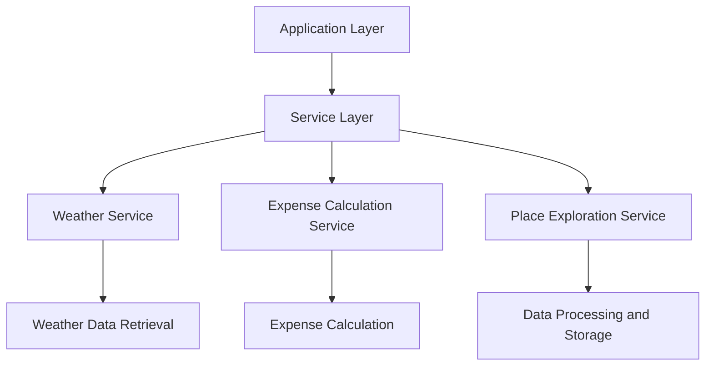

## Deployment/Infrastructure

### Related Pages

Related topics: [Extensibility and Customization](#page-10)


<details>
<summary>Relevant source files</summary>

- [src/agent/graph_wf.py](src/agent/graph_wf.py)
- [src/tools/weather_tool.py](src/tools/weather_tool.py)
- [src/utils/weather.py](src/utils/weather.py)
- [src/utils/utils_main.py](src/utils/utils_main.py)
- [src/utils/utils_places.py](src/utils/utils_places.py)
</details>

# Deployment/Infrastructure

This section provides a comprehensive overview of the deployment and infrastructure architecture of the project. The infrastructure is designed to support the application's functionality, ensuring scalability, reliability, and efficient resource utilization. The system is built with a modular approach, leveraging various tools and services to handle different aspects of the application's operation.

## Architecture Overview

The deployment infrastructure is composed of several key components, including:

- **Application Layer**: This layer contains the core application logic, business rules, and data processing modules. It is responsible for handling user requests, processing data, and generating responses.
- **Service Layer**: This layer includes various services that support the application, such as weather data retrieval, expense calculation, and place exploration. These services are designed to be decoupled and can be independently scaled or updated.
- **Data Layer**: This layer handles data storage and retrieval, including databases, caches, and external data sources. It ensures that data is stored efficiently and can be accessed quickly.
- **Infrastructure Layer**: This layer includes the underlying computing resources, such as servers, networks, and storage systems. It ensures that the application has the necessary resources to run smoothly.

## Key Components and Services

### Weather Service

The weather service is responsible for fetching real-time weather data for a given location. It uses the `WeatherTool` class to retrieve weather information from the `weather` API. The service supports both current weather and forecast data, providing detailed information about temperature, conditions, and other relevant details.

### Expense Calculation Service

The expense calculation service is designed to compute the total costs associated with a trip, including hotel, food, transportation, and activities. It uses the `ExpensesCalcTool` class to perform calculations based on provided data, such as price per night and number of nights. The service provides a detailed breakdown of costs, allowing users to plan their budgets effectively.

### Place Exploration Service

The place exploration service is responsible for fetching information about attractions, restaurants, and activities in a given city. It uses the `PlaceExplorerTool` class to retrieve data from various sources, including Google and Tavily search engines. The service provides detailed information about the places, including their locations, descriptions, and other relevant details.

### Data Processing and Storage

The data processing and storage layer handles the ingestion and transformation of data from various sources. It uses tools like `MathUtils` for mathematical operations and `utils_main` for data manipulation. The service ensures that data is stored efficiently and can be accessed quickly, supporting the application's performance and scalability.

## Mermaid Diagrams



## Tables

### Key Features and Components

| Component | Description |
|----------|-------------|
| Application Layer | Core application logic and business rules |
| Service Layer | Supporting services like weather, expense calculation, and place exploration |
| Data Layer | Data storage and retrieval systems |
| Infrastructure Layer | Computing resources and networks |

### API Endpoint Parameters

| Endpoint | Parameters | Description |
|---------|-------------|-------------|
| /weather | city, appid, units | Retrieve weather data |
| /forecast | city, appid, cnt | Retrieve forecast data |

### Configuration Options

| Configuration | Type | Default Value |
|--------------|------|----------------|
| Weather API Key | String | None |
| Expense Calculation API Key | String | None |

## Code Snippets

```python
# Example of weather data retrieval
def get_weather(city):
    url = f"{self.base_url}/weather"
    params = {"q": city, "appid": self.api_key, "units": "metric"}
    response = requests.get(url, params=params)
    return response.json() if response.status_code == 200 else dict()
```

```python
# Example of expense calculation
def calculate_total_hotel_expenses(price_per_night, number_of_nights):
    return float(price_per_night) * float(number_of_nights)
```

## Sources

- [src/agent/graph_wf.py](src/agent/graph_wf.py): Contains the architecture diagram and key components
- [src/tools/weather_tool.py](src/tools/weather_tool.py): Contains the weather service implementation
- [src/utils/weather.py](src/utils/weather.py): Contains the weather data retrieval implementation
- [src/utils/utils_main.py](src/utils/utils_main.py): Contains the expense calculation implementation
- [src/utils/utils_places.py](src/utils/utils_places.py): Contains the place exploration service implementation

---

